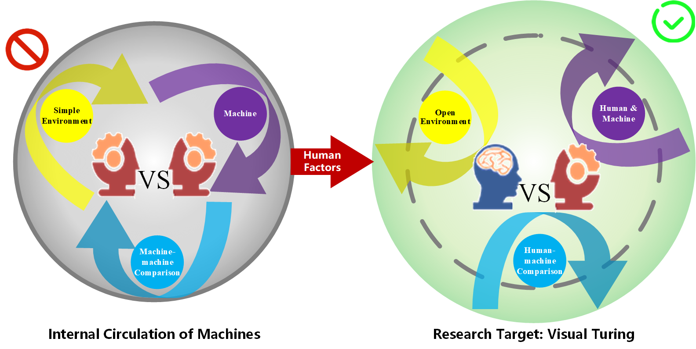
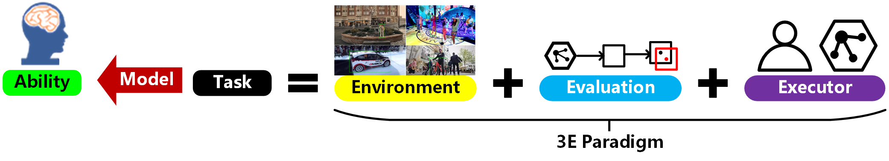

# 🔍️ Research Interests

## Research Foundation

My research has long focused on **evaluating and modeling machine vision intelligence**, covering task modeling, environment construction, evaluation techniques, and human–machine comparisons. I firmly believe that ***the development of artificial intelligence is inherently intertwined with human factors***. Inspired by the classical ***Turing Test***, I have extended this concept to visual understanding, proposing the ***Visual Turing Test*** as a human-centered framework for evaluating dynamic vision tasks. The overarching goal is to benchmark machine visual intelligence against human abilities, building **trustworthy and explainable evaluation systems** that advance us toward secure and reliable Artificial General Intelligence (AGI).

---

### 1️⃣ What abilities define human perception? Designing more human-like visual tasks

I take **Visual Object Tracking (VOT)** as a representative task to explore the boundaries of machine dynamic visual ability. Traditional VOT is limited by its assumption of continuous motion, which fails to align with human cognitive tracking capabilities. To overcome this, I proposed ***Global Instance Tracking (GIT)*** — a humanoid-inspired reformulation that shifts tracking from a short-term perceptual level to a long-term **cognitive level**. Building on this, I introduced ***Multi-modal GIT (MGIT)*** by incorporating hierarchical semantic structures, enabling machines to perform **visual reasoning** over complex spatio-temporal causal relationships. Together, these extensions mark a transition from perceptual recognition to cognitive understanding.

---

### 2️⃣ What environments do humans perceive? Constructing more open and realistic visual spaces

Human environments are dynamic, continuous, and semantically rich, yet most datasets remain static and task-limited. To address this, I developed the ***[VideoCube](http://videocube.aitestunion.com/)*** benchmark by integrating **narrative theory** to decompose video content into interpretable units. Building further, I proposed ***[SOTVerse](https://huuuuusy.github.io/#SOTVerse)***, a large-scale and open **task space** (12.56M frames) that enables flexible subspace generation for evaluating **visual generalization** across diverse conditions. To tackle visual robustness in real-world dynamics, I further developed ***[BioDrone](https://huuuuusy.github.io/#BioDrone)*** — the first bio-inspired flapping-wing drone benchmark — providing a novel testing ground for **robust visual intelligence** under motion perturbations and environmental challenges.

---

### 3️⃣ How large is the human–machine gap? Benchmarking machine vision against human ability

While computer scientists evaluate models on large datasets and neuroscientists assess humans in controlled experiments, this disciplinary gap prevents unified human–machine evaluation. To bridge this, I constructed a unified evaluation environment based on SOTVerse, enabling **direct human–machine comparisons** in perception, cognition, and robustness. Results reveal that recent algorithms are closing the gap with human subjects, with humans excelling in semantic understanding and machines in precision and persistence. This complementary behavior suggests the emerging potential for ***human–machine collaborative intelligence*** in dynamic vision.

---

This human-centered evaluation paradigm is formalized as the ***3E Framework*** — **Environment**, **Evaluation**, and **Executors** — forming a closed loop that defines, measures, and evolves intelligent behavior. Machines acquire human-like abilities by iteratively performing humanoid proxy tasks within evolving environments and evaluation criteria. Through this iterative mechanism, their cognitive upper bounds are continuously improved, laying the foundation for building **evaluative, explainable, and human-aligned intelligence**.

---

## Current Research Interests

**Visual Intelligence**  
- Focuses on visual intelligence as the core channel to study how AI systems perceive, reason, and interpret in complex environments.  
- Builds interpretable and generalizable cognitive evaluation frameworks under the “Environment–Task–Executor” paradigm.  
- Explores unified quantitative models for robustness, generalization, and safety, promoting a paradigm shift from performance-driven to cognition-driven evaluation.  
- Investigates human-referenced measurement principles of intelligence to support the development of human–AI integrated cognitive systems.  

**Multimodal Cognition**  
- Investigates the structural role of vision within multimodal cognition, exploring unified mechanisms for cross-modal fusion and spatiotemporal reasoning.  
- Develops multiscale models from perception to semantics to reveal intrinsic connections among vision, language, and knowledge.  
- Studies semantic diversity, causal associations, and narrative generation to build explainable and generalizable multimodal understanding frameworks.  
- Advances visual understanding from static perception toward dynamic cognition, providing a structural foundation for next-generation multimodal intelligence.  

**AI4Edu**  
- Positions educational environments as ideal domains for studying human–AI co-evolution and cognitive learning mechanisms.  
- Focuses on intelligent agents with personality, cognition, and social adaptability, emphasizing cognitive tracking, personalized feedback, and adaptive learning.  
- Explores multi-agent collaboration and reflective learning mechanisms, enabling human–AI interaction with understanding, empathy, and shared growth.  
- Promotes the transformation of educational AI from an assistive tool to a cognitive partner, fostering educational equity, innovation, and sustainable learning.  

**AI4Science**  
- Explores the cognitive modeling pathways of AI in scientific discovery, experimental design, and knowledge reasoning.  
- Studies AI’s cognitive role in scientific understanding, data modeling, and hypothesis generation, abstracting cognitive principles from human reasoning.  
- Constructs integrated vision–language–symbol frameworks for scientific intelligence, bridging computational learning and human scientific cognition.  
- Advances interdisciplinary applications of AI in education, medicine, psychology, and cognitive science toward the co-evolution of artificial and human intelligence.  
