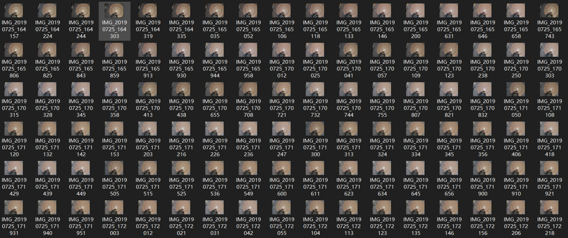

# ⚙️ Projects

> The list here mainly includes engineering projects, while more academic projects have already been published in the form of research papers. Please refer to the [📝 Publications](https://huuuuusy.github.io/#-publications) for more information.

2018.03-2018.11

**Darknet-Cross: Light-weight Deep Learning Framework for Heterogeneous Computing** 
📌 High-performance Computing 📌 Heterogeneous Computing 📌 Deep learning Framework 
- [Darknet-Cross](https://github.com/huuuuusy/Darknet-Cross) is a lightweight deep learning framework, mainly based on the open-source deep learning algorithm library Darknet and yolov2_light, and it has been successfully ported to mobile devices through cross-compilation. This framework enables efficient algorithm inference using mobile GPUs.
- Darknet-Cross supports algorithm acceleration processing on various platforms (e.g., Android and Ubuntu) and various GPUs (e.g., Nvidia GTX1070 and Adreno 630).
- The work is a part of my master's thesis at the University of Hong Kong (thesis defense grade: A+).

2019.05 - 2019.10

<!-- 
2019.05 - 2019.10
 -->

**A Skin Color Detection System without Color Atla** 
📌 Color Constancy 📌 Skin Color Detection 📌 Illumination Estimation 
- Under 18 different environmental lighting conditions and with 4 combinations of smartphone parameters, skin color data was collected from 110 participants. The skin color dataset consists of 7,920 images, with the testing results from CK Company's MPA9 skin color detector serving as the ground truth for user skin colors.
- Using an elliptical skin model, the essential skin regions are extracted from the images. The open-source color constancy model, FC4, is employed to recover the environmental lighting conditions. Subsequently, the skin color detection results for users are calculated using SVR regression.
- The related work has been successfully deployed in Huawei's official mobile application 'Mirror' for its AI skin testing function.

2020.11 - 2021.03

**A Project for Cell Tracking Based on Deep Learning Method** 
📌 Medical Image Processing 📌 AI4Science 📌 Cell Segmentation and Tracking 
- This method follows the tracking by detection paradigm and combines per-frame CNN prediction for cell segmentation with a Siamese network for cell tracking. 
- This project was submitted to the cell tracking challenge in Mar. 2021, and maintains the second place in the Fluo-C2FL-MSC+ dataset and the third place in the Fluo-C2FL-Huh7 dataset (statistics by Oct. 2023).

2024.01 - Now

**Research on the Dilemma and Countermeasures of Human-Computer Interaction in Intelligent Education** 
📌 Intelligent Education Technology 📌 Human-Computer Interaction 📌 AI4Science 
- Incorporating insights and methodologies from education, cognitive psychology, and computer science, this project establishes a theoretical framework for understanding the evolution of HCI within the intelligent education.
- Drawing upon the established theoretical framework, this project conducts a comprehensive analysis of the evolution of HCI in educational settings, transitioning from collaboration to integration. Furthermore, it delves into the key issues arising from this transformative process within the realm of intelligent education.
- Building upon the core issues unearthed, this project investigates strategies for leveraging theoretical guidance and technical enhancements to enhance the efficacy of HCI in intelligent education, ultimately striving towards effective human-computer integration.
- The project is funded by the 2023 Intelligent Education PhD Research Fund, supported by the Institute of AI Education Shanghai and East China Normal University, and is currently in progress.

