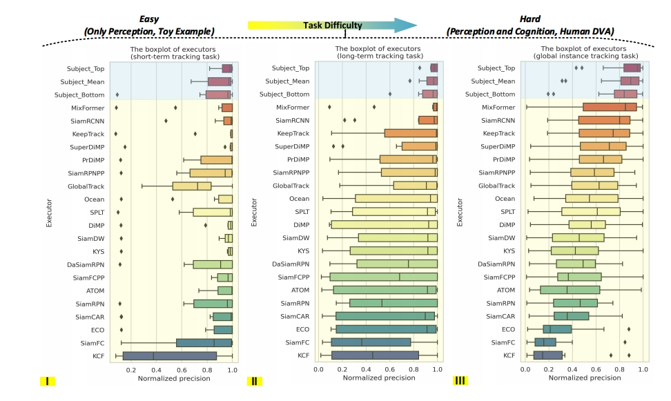

# ⚙️ Projects

> The list here mainly includes engineering projects and ongoing academic projects, while more academic projects have already been published in the form of research papers. Please refer to the [📝 Publications](https://huuuuusy.github.io/#-publications) for more information.

2018.03-2018.11

**Darknet-Cross: Light-weight Deep Learning Framework for Heterogeneous Computing** 
- [Darknet-Cross](https://github.com/huuuuusy/Darknet-Cross) is a lightweight deep learning framework, mainly based on the open-source deep learning algorithm library Darknet and yolov2_light, and it has been successfully ported to mobile devices through cross-compilation. This framework enables efficient algorithm inference using mobile GPUs.
- Darknet-Cross supports algorithm acceleration processing on various platforms (e.g., Android and Ubuntu) and various GPUs (e.g., Nvidia GTX1070 and Adreno 630).
- The work is a part of my master's thesis at the University of Hong Kong (thesis defense grade: A+).

2019.05 - 2019.10

**A Skin Color Detection System without Colour Atla** 
- Under 18 different environmental lighting conditions and with 4 combinations of smartphone parameters, skin color data was collected from 110 participants. The skin color dataset consists of 7,920 images, with the testing results from CK Company's MPA9 skin color detector serving as the ground truth for user skin colors.
- Using an elliptical skin model, the essential skin regions are extracted from the images. The open-source color constancy model, FC4, is employed to recover the environmental lighting conditions. Subsequently, the skin color detection results for users are calculated using SVR regression.
- The related work has been successfully deployed in Huawei's official mobile application 'Mirror' for its AI skin testing function.

2020.11 - 2021.03

**A Project for Cell Tracking Based on Deep Learning Method** 
- This method follows the tracking by detection paradigm and combines per-frame CNN prediction for cell segmentation with a Siamese network for cell tracking. 
- This project was submitted to the cell tracking challenge in Mar. 2021, and maintains the second place in the Fluo-C2FL-MSC+ dataset and the third place in the Fluo-C2FL-Huh7 dataset (statistics by Oct. 2023).

2022.04 - Now

**Intelligent Evaluation Techniques for Visual Object Tracking Based on Visual Turing Test** 
- This work proposes the visual Turing test evaluation paradigm by incorporating the concept of the Turing test, enabling a comprehensive assessment of the visual intelligence of algorithms in comparison to human visual capabilities.
- A controlled experimental environment has been developed to facilitate a fair comparison of dynamic visual abilities between humans and machines. This environment incorporates the perceptual and cognitive capabilities that task objects necessitate during the execution of dynamic visual tasks.
- A suitable task object is selected to conduct tests on human-machine dynamic visual abilities, involving 20 representative algorithms and 15 human subjects.
- A universally applicable multi-scale dynamic visual task evaluation framework has been designed. This framework employs center point distance to assess and analyze tasks at three distinct scales, namely frame-level, sequence-level, and group-level.
- Two Chinese review papers were published in 2021 and 2023. The experimental content and main conclusions are being finalized, preparing for submission to the Cell Patterns journal.

