# 📝 Publications

<!-- ## Paper Summary

### Journal

- **TPAMI**: IEEE Transactions on Pattern Analysis and Machine Intelligence (CCF-A Journal, Top-1 journal in computer vision, IF=20.8). ***Acceptance×1 (first author×1)***
- **IJCV**: International Journal of Computer Vision (CCF-A Journal, Top-2 journal in computer vision, IF=11.6). ***Acceptance×2 (first author×1, corresponding-author×1)***
- **TCSVT**: IEEE Transactions on Circuits and Systems for Video Technology (CCF-B Journal, IF=8.3). ***Acceptance×1, under review×1***
- **JIG**: Journal of Images and Graphics (《中国图象图形学报》, CCF-B Chinese Journal). ***Acceptance×1 (first author×1)***
- **JOG**: Journal of Graphics (《图学学报》, CCF-C Chinese Journal). ***Acceptance×1***
- **Neu**: Neurocomputing (CCF-C Journal, IF=5.5). ***Acceptance×1***
- **CMHJ**: Chinese Mental Health Journal (《中国心理卫生杂志》, CSSCI Journal, Top Psychological Journal in China) ***Acceptance×1***
- **APS**: Acta Psychologica Sinica (《心理学报》, CSSCI Journal, Top-1 Psychological Journal in China). ***Under review×1***

### Conference

- **NeurIPS**: Conference on Neural Information Processing Systems (CCF-A Conference). ***Acceptance×3 (first author×1)***
- **ICLR**: International Conference on Learning Representations (CAAI-A Conference). ***Under review×3 (first author×2)***
- **AAAI**: Annual AAAI Conference on Artificial Intelligence (CCF-A Conference). ***Under review×1***
- **NeurIPSW**: Workshop in Conference on Neural Information Processing Systems (CCF-A Conference workshop). ***Under review×1***
- **CVPRW**: Workshop in IEEE/CVF Conference on Computer Vision and Pattern Recognition (CCF-A Conference workshop). ***Acceptance×1 (oral & best paper honorable mention×1)***
- **ICASSP**: IEEE International Conference on Acoustics, Speech, and Signal Processing (CCF-B Conference). ***Acceptance×1, under review×1***
- **PRCV**: Chinese Conference on Pattern Recognition and Computer Vision (CCF-C Conference). ***Acceptance×2***
- **CSAI**: International Conference on Computer Science and Artificial Intelligence (EI Conference). ***Acceptance×1 (oral×1)*** -->

## Book

Springer 2025
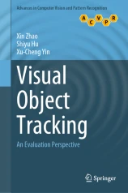

**Visual Object Tracking: An Evaluation Perspective** 
[X. Zhao](https://www.xinzhaoai.com/), ***Shiyu Hu***,  [X. Yin](https://scce.ustb.edu.cn/shiziduiwu/jiaoshixinxi/2018-04-12/62.html) 
*[Springer, Part of the book series: Advances in Computer Vision and Pattern Recognition (ACVPR)](https://www.springer.com/series/4205)* 
📌 Visual Object Tracking 📌 Intelligent Evaluation Technology  
[📃 Book](https://link.springer.com/book/9789819645572)
<!-- [🗒 bibTex](https://huuuuusy.github.io/files/GIT.bib) -->
<!-- [📑 PDF](https://huuuuusy.github.io/files/GIT.pdf) -->

## Acceptance

<!-- 前5篇代表作按照固定顺序排列 -->

TPAMI 2023

**Global Instance Tracking: Locating Target More Like Humans** 
***Shiyu Hu***, [X. Zhao](https://www.xinzhaoai.com/), [L. Huang](https://github.com/huanglianghua), [K. Huang](https://people.ucas.ac.cn/~huangkaiqi) 
*[IEEE Transactions on Pattern Analysis and Machine Intelligence](https://ieeexplore.ieee.org/xpl/RecentIssue.jsp?punumber=34) (CCF-A Journal)* 
📌 Visual Object Tracking 📌 Large-scale Benchmark Construction 📌 Intelligent Evaluation Technology  
[📃 Paper](https://ieeexplore.ieee.org/document/9720246/)
[📑 PDF](https://huuuuusy.github.io/files/GIT.pdf)
[🪧 Poster](https://huuuuusy.github.io/files/VALSE24Poster-364.pdf)
[🌐 Platform](http://videocube.aitestunion.com/)
[🔧 Toolkit](https://github.com/huuuuusy/videocube-toolkit) 
[💾 Dataset](http://videocube.aitestunion.com/downloads)
<!-- [🗒 bibTex](https://huuuuusy.github.io/files/GIT.bib) -->

IJCV 2024

**SOTVerse: A User-defined Task Space of Single Object Tracking** 
***Shiyu Hu***, [X. Zhao](https://www.xinzhaoai.com/), [K. Huang](https://people.ucas.ac.cn/~huangkaiqi) 
*[International Journal of Computer Vision](https://www.springer.com/journal/11263) (CCF-A Journal)* 
📌 Visual Object Tracking 📌 Dynamic Open Environment Construction 📌 3E Paradigm 
[📃 Paper](https://link.springer.com/article/10.1007/s11263-023-01908-5)
[📑 PDF](https://huuuuusy.github.io/files/SOTVerse.pdf)
[🌐 Platform](http://metaverse.aitestunion.com/) 
<!-- [🗒 bibTex](https://huuuuusy.github.io/files/SOTVerse.bib) -->

IJCV 2024

**BioDrone: A Bionic Drone-based Single Object Tracking Benchmark for Robust Vision** 
[X. Zhao](https://www.xinzhaoai.com/), ***Shiyu Hu✉️***, [Y. Wang](https://scholar.google.com.hk/citations?hl=zh-CN&user=nMe_kLAAAAAJ), J. Zhang, Y. Hu, R. Liu, [H. Lin](https://www3.cs.stonybrook.edu/~hling/), [Y. Li](https://www.biostat.wisc.edu/~yli/), R. Li, K. Liu, [J. Li](http://yjsb.sinano.ac.cn/Doctor/info.aspx?itemid=920)  
*[International Journal of Computer Vision](https://www.springer.com/journal/11263) (CCF-A Journal)* 
📌 Visual Object Tracking 📌 Drone-based Tracking 📌 Visual Robustness 
[📃 Paper](https://link.springer.com/article/10.1007/s11263-023-01937-0)
[🌐 Platform](http://biodrone.aitestunion.com/) 
[📑 PDF](https://huuuuusy.github.io/files/BioDrone.pdf)
[🔧 Toolkit](https://github.com/huuuuusy/biodrone-toolkit-official) 
[💾 Dataset](http://biodrone.aitestunion.com/downloads) 
<!-- [🗒 bibTex](https://huuuuusy.github.io/files/BioDrone.bib)  -->

NeurIPS 2023

**A Multi-modal Global Instance Tracking Benchmark (MGIT): Better Locating Target in Complex Spatio-temporal and causal Relationship** 
***Shiyu Hu***, [D. Zhang](https://scholar.google.com.hk/citations?user=ApH4wOcAAAAJ), [M. Wu](https://scholar.google.com.hk/citations?user=fGc7NVAAAAAJ), [X. Feng](https://scholar.google.com.hk/citations?user=NqXtIPIAAAAJ), [X. Li](https://github.com/Xuchen-Li), [X. Zhao](https://www.xinzhaoai.com/), [K. Huang](https://people.ucas.ac.cn/~huangkaiqi) 
*[Conference on Neural Information Processing Systems](https://neurips.cc/Conferences/2023) (CCF-A Conference, Poster)* 
📌 Visual Language Tracking 📌 Long Video Understanding and Reasoning 📌 Hierarchical Semantic Information Annotation 
[📃 Paper](https://proceedings.nips.cc/paper_files/paper/2023/hash/4ea14e6090343523ddcd5d3ca449695f-Abstract-Datasets_and_Benchmarks.html) 
[📃 PDF](https://huuuuusy.github.io/files/MGIT.pdf)
[🪧 Poster](https://huuuuusy.github.io/files/MGIT-poster.pdf)
[📹 Slides](https://huuuuusy.github.io/files/MGIT-Slides.pdf)
[🌐 Platform](http://videocube.aitestunion.com/)
[🔧 Toolkit](https://github.com/huuuuusy/videocube-toolkit) 
[💾 Dataset](http://videocube.aitestunion.com/downloads)
<!-- [🗒 bibTex](https://huuuuusy.github.io/files/MGIT.bib) -->

中国图象图形学报 2023

**Visual Intelligence Evaluation Techniques for Single Object Tracking: A Survey (单目标跟踪中的视觉智能评估技术综述)** 
***Shiyu Hu***, [X. Zhao](https://www.xinzhaoai.com/), [K. Huang](https://people.ucas.ac.cn/~huangkaiqi) 
*[Journal of Images and Graphics](http://www.cjig.cn/jig/ch/index.aspx) (《中国图象图形学报》, CCF-B Chinese Journal)* 
📌 Visual Object Tracking 📌 Intelligent Evaluation Technique 📌 AI4Science 
[📃 Paper](http://www.cjig.cn/jig/ch/reader/view_abstract.aspx?flag=2&file_no=202307100000002&journal_id=jig) 
[📑 PDF](https://huuuuusy.github.io/files/JIG-survey.pdf) 

ICMR 2025
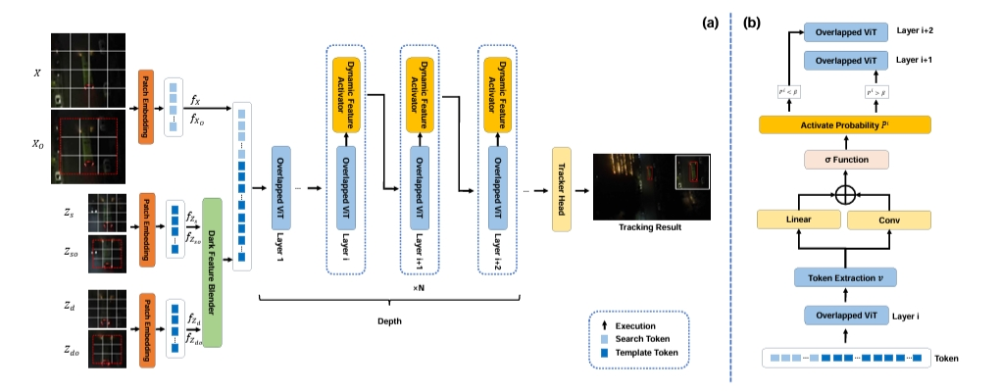

**DARTer: Dynamic Adaptive Representation Tracker for Nighttime UAV Tracking** 
[X. Li\*](https://github.com/XuzhaoLi), [X. Li\*](https://github.com/Xuchen-Li), ***Shiyu Hu✉️***, 
*[International Conference on Multimedia Retrieval](https://www.icmr-2025.org/) (CCF-B Conference)* 
📌 Nighttime UAVs Tracking 📌 Dark Feature Blending 📌 Dynamic Feature Activation  
[📃 Paper](https://www.arxiv.org/abs/2505.00752)
[📑 PDF](https://www.arxiv.org/pdf/2505.00752)

IET-CVI 2025
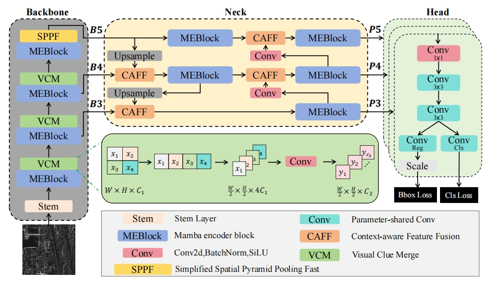

**Improved SAR Aircraft Detection Algorithm Based on Visual State Space Models** 
Y. Wang, J. Zhang, [Y. Wang](https://scholar.google.com.hk/citations?hl=zh-CN&user=nMe_kLAAAAAJ), ***Shiyu Hu✉️***, B. Shen, Z. Hou, [W. Zhou](https://scholar.google.com/citations?user=r8x76hUAAAAJ). 
*[IET Computer Vision](https://digital-library.theiet.org/journal/iet-cvi) (CCF-C Journal)* 
📌 Synthetic Aperture Radar 📌 State Space Models 📌 Aircraft Object Detection  
<!-- [📃 Paper](https://www.arxiv.org/abs/2505.00752) -->
<!-- [📑 PDF](https://www.arxiv.org/pdf/2505.00752) -->

<!-- 合作论文按时间顺序排列 -->

ICML 2025
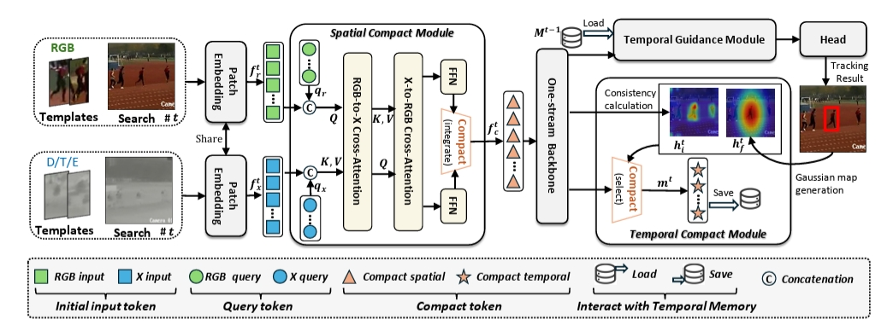

**CSTrack: Enhancing RGB-X Tracking via Compact Spatiotemporal Features** 
[X. Feng](https://scholar.google.com.hk/citations?user=NqXtIPIAAAAJ), [D. Zhang](https://scholar.google.com.hk/citations?user=ApH4wOcAAAAJ), ***Shiyu Hu***, [X. Li](https://github.com/Xuchen-Li), [M. Wu](https://scholar.google.com.hk/citations?user=fGc7NVAAAAAJ), J. Zhang, X. Chen, [K. Huang](https://people.ucas.ac.cn/~huangkaiqi)   
*[International Conference on Machine Learning](https://icml.cc/) (CCF-A Conference, Poster)* 
📌 Visual Object Tracking 📌 Multi-modal Learning  

NeurIPS 2024
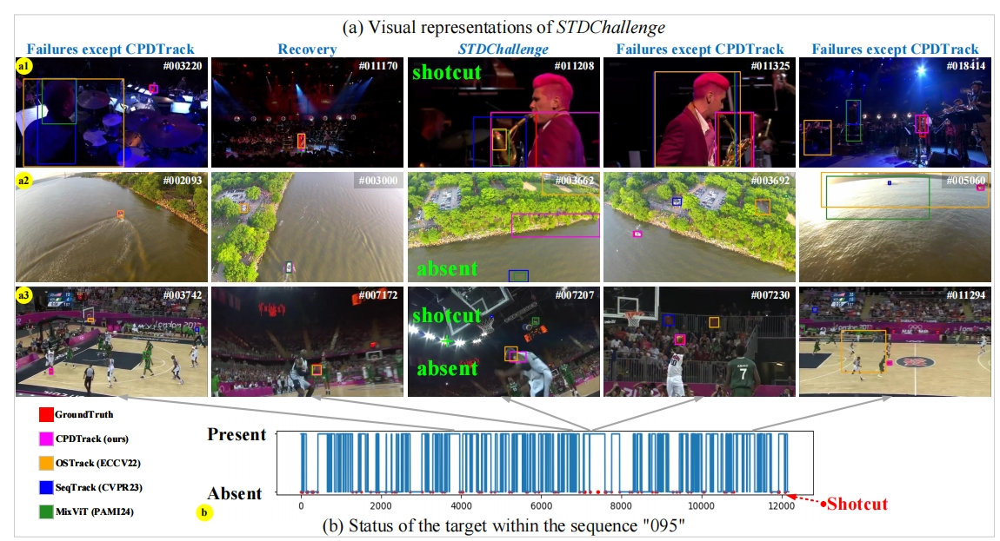

**Beyond Accuracy: Tracking more like Human via Visual Search** 
[D. Zhang](https://scholar.google.com.hk/citations?user=ApH4wOcAAAAJ), ***Shiyu Hu***, [X. Feng](https://scholar.google.com.hk/citations?user=NqXtIPIAAAAJ), [X. Li](https://github.com/Xuchen-Li), [M. Wu](https://scholar.google.com.hk/citations?user=fGc7NVAAAAAJ), J. Zhang, [K. Huang](https://people.ucas.ac.cn/~huangkaiqi)   
*[Conference on Neural Information Processing Systems](https://neurips.cc/Conferences/2024) (CCF-A Conference, Poster)* 
📌  Visual Object Tracking 📌 Visual Search Mechanism 📌 Visual Turing Test 

NeurIPS 2024

**MemVLT: Vision-Language Tracking with Adaptive Memory-based Prompts** 
[X. Feng](https://scholar.google.com.hk/citations?user=NqXtIPIAAAAJ), [X. Li](https://github.com/Xuchen-Li), ***Shiyu Hu***, [D. Zhang](https://scholar.google.com.hk/citations?user=ApH4wOcAAAAJ), [M. Wu](https://scholar.google.com.hk/citations?user=fGc7NVAAAAAJ), J. Zhang, X. Chen, [K. Huang](https://people.ucas.ac.cn/~huangkaiqi)   
*[Conference on Neural Information Processing Systems](https://neurips.cc/Conferences/2024) (CCF-A Conference, Poster)* 
📌 Visual Language Tracking 📌 Human-like Memory Modeling 📌 Adaptive Prompts 

CVPRW 2024
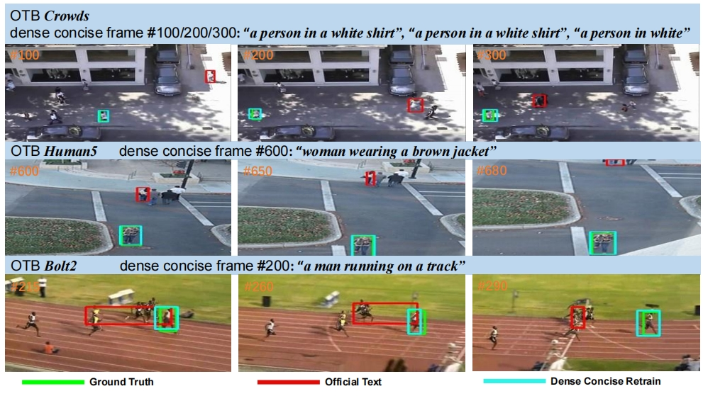

**Diverse Text Generation for Visual Language Tracking Based on LLM** 
[X. Li](https://github.com/Xuchen-Li), [X. Feng](https://scholar.google.com.hk/citations?user=NqXtIPIAAAAJ), ***Shiyu Hu***, [M. Wu](https://scholar.google.com.hk/citations?user=fGc7NVAAAAAJ), [D. Zhang](https://scholar.google.com.hk/citations?user=ApH4wOcAAAAJ), J. Zhang, [K. Huang](https://people.ucas.ac.cn/~huangkaiqi) 
*[the 3rd Workshop on Vision Datasets Understanding and DataCV Challenge in CVPR 2024](https://sites.google.com/view/vdu-cvpr24/) (Workshop in CCF-A Conference, Oral, Best Paper Honorable Mention)* 
📌 Visual Language Tracking 📌 Large Language Model 📌 Evaluation Technique 
[📃 Paper](https://arxiv.org/abs/2405.12139) 
[🗒 bibTex](https://huuuuusy.github.io/files/DTLLM-VLT.bib)
[📃 PDF](https://huuuuusy.github.io/files/DTLLM-VLT.pdf)
[🪧 Poster](https://github.com/Xuchen-Lifiles/DTLLM-poster.pdf)
[📹 Slides](https://github.com/Xuchen-Lifiles/DTLLM-Slides.pdf)
[🌐 Platform](http://videocube.aitestunion.com/)
[🔧 Toolkit](https://github.com/Xuchen-Li/DTLLM-VLT) 
[💾 Dataset](http://videocube.aitestunion.com/downloads)
[🏆 Award](https://huuuuusy.github.io/files/DTLLM-VLT-Award.pdf)

ICASSP 2025
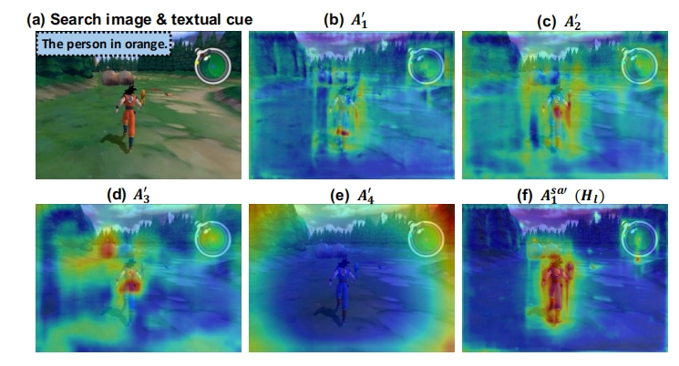

**Enhancing Vision-Language Tracking by Effectively Converting Textual Cues into Visual Cues** 
[X. Feng](https://scholar.google.com.hk/citations?user=NqXtIPIAAAAJ), [D. Zhang](https://scholar.google.com.hk/citations?user=ApH4wOcAAAAJ), ***Shiyu Hu***, [X. Li](https://github.com/Xuchen-Li),  [M. Wu](https://scholar.google.com.hk/citations?user=fGc7NVAAAAAJ), J. Zhang, X. Chen, [K. Huang](https://people.ucas.ac.cn/~huangkaiqi)  
*[IEEE International Conference on Acoustics, Speech, and Signal Processing](https://2025.ieeeicassp.org/) (CCF-B Conference, Poster)* 
📌 Visual Language Tracking 📌 Multi-modal Learning 📌 Grounding Model 

ICASSP 2024

**Robust Single-particle Cryo-EM Image Denoising and Restoration** 
J. Zhang, T. Zhao, ***Shiyu Hu***, [X. Zhao](https://www.xinzhaoai.com/) 
*[IEEE International Conference on Acoustics, Speech, and Signal Processing](https://2024.ieeeicassp.org/) (CCF-B Conference, Poster)* 
📌 Medical Image Processing 📌 AI4Science 📌 Diffusion Model 
[📃 Paper](https://ieeexplore.ieee.org/abstract/document/10447135) 
[🗒 bibTex](https://huuuuusy.github.io/files/ICASSP24.bib)
[📑 PDF](https://huuuuusy.github.io/files/ICASSP24.pdf)

TCSVT 2024

**Finger in Camera Speaks Everything: Unconstrained Air-Writing for Real-World** 
[M. Wu](https://scholar.google.com.hk/citations?user=fGc7NVAAAAAJ), [K. Huang](https://people.ucas.ac.cn/~huangkaiqi), [Y. Cai](https://teacher.bupt.edu.cn/caiyuanqiang/zh_CN/index.htm), ***Shiyu Hu***, [Y. Zhao](https://callsys.github.io/zhaoyuzhong.github.io-main/), [W. Wang](https://people.ucas.ac.cn/~wqwang?language=en)  
*[IEEE Transactions on Circuits and Systems for Video Technology](https://ieeexplore.ieee.org/xpl/RecentIssue.jsp?punumber=76) (CCF-B Journal)* 
📌 Air-writing Technique 📌 Benchmark Construction 📌 Human-machine Interaction 
[📃 Paper](https://ieeexplore.ieee.org/document/10496279) 
[🗒 bibTex](https://huuuuusy.github.io/files/AWCV100k.bib)
[📃 PDF](https://huuuuusy.github.io/files/AWCV100k.pdf)
[🔧 Toolkit](https://github.com/wmeiqi/AWCV) 

PRCV 2024
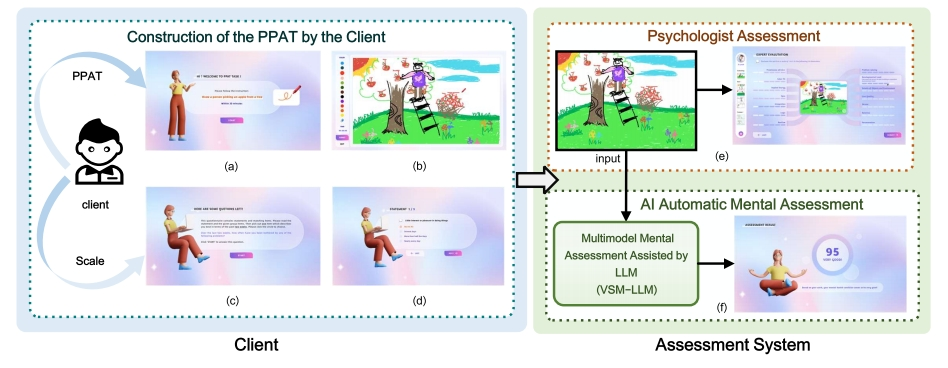

**VS-LLM: Visual-Semantic Depression Assessment based on LLM for Drawing Projection Test** 
[M. Wu](https://scholar.google.com.hk/citations?user=fGc7NVAAAAAJ), Y. Kang, [X. Li](https://github.com/Xuchen-Li), ***Shiyu Hu***, X. Chen, Y. kang, [W. Wang](https://people.ucas.ac.cn/~wqwang?language=en), [K. Huang](https://people.ucas.ac.cn/~huangkaiqi)  
*[Chinese Conference on Pattern Recognition and Computer Vision](https://www.prcv.cn) (CCF-C Conference)* 
📌 Psychological Assessment System 📌 Gamified Assessment 📌 AI4Science 
[📃 Paper](https://link.springer.com/chapter/10.1007/978-981-97-8692-3_17) 
[🗒 bibTex](https://huuuuusy.github.io/files/VSLLM.bib)
[📃 PDF](https://huuuuusy.github.io/files/VSLLM.pdf)

PRCV 2023

**A Hierarchical Theme Recognition Model for Sandplay Therapy** 
[X. Feng](https://scholar.google.com.hk/citations?user=NqXtIPIAAAAJ), ***Shiyu Hu***, X. Chen, [K. Huang](https://people.ucas.ac.cn/~huangkaiqi) 
*[Chinese Conference on Pattern Recognition and Computer Vision](https://www.prcv2023.cn/2023prcv) (CCF-C Conference, Poster)* 
📌 Psychological Assessment System 📌 Gamified Assessment 📌 AI4Science 
[📃 Paper](https://link.springer.com/chapter/10.1007/978-981-99-8462-6_20) 
[🗒 bibTex](https://huuuuusy.github.io/files/PRCV23.bib) 
[📑 PDF](https://huuuuusy.github.io/files/PRCV23.pdf)
[🔖 Supplementary](https://huuuuusy.github.io/files/PRCV23-Supp.pdf)
[🪧 Poster](https://huuuuusy.github.io/files/PRCV23-poster.pdf)

Neurocomputing 2022

**Revisiting Instance Search: A New Benchmark Using Cycle Self-training** 
[Y. Zhang](https://wesleyzhang1991.github.io/), [C. Liu](https://scholar.google.com/citations?user=atOfOgMAAAAJ&hl=zh-CN&oi=sra), [W. Chen](https://scholar.google.com/citations?user=KWVlYaMAAAAJ&hl=zh-CN&oi=sra), [X. Xu](https://scholar.google.com/citations?user=nJc6BvgAAAAJ&hl=zh-CN&oi=sra), [F. Wang](https://scholar.google.com/citations?user=WCRGTHsAAAAJ), [H. Li](https://scholar.google.com/citations?user=pHN-QIwAAAAJ&hl=zh-CN&oi=sra), ***Shiyu Hu***, [X. Zhao](https://www.xinzhaoai.com/) 
*[Neurocomputing](https://www.sciencedirect.com/journal/neurocomputing)  (CCF-C Journal)* 
📌 Video Instance Search 📌 Benchmark Construction  📌 Data Mining 
[📃 Paper](https://www.sciencedirect.com/science/article/abs/pii/S0925231222007445) 
[🗒 bibTex](https://huuuuusy.github.io/files/Neu22.bib) 
[📑 PDF](https://huuuuusy.github.io/files/Neu22.pdf) 
[🌐 Project](https://github.com/Instance-Search/) 

图学学报 2021

**Visual Turing: The Next Development of Computer Vision in The View of Human-computer Gaming (视觉图灵：从人机对抗看计算机视觉下一步发展)** 
[K. Huang](https://people.ucas.ac.cn/~huangkaiqi), [X. Zhao](https://www.xinzhaoai.com/), [Q. Li](https://scholar.google.com/citations?user=7xmxBagAAAAJ), ***Shiyu Hu*** 
*[Journal of Graphics](http://www.txxb.com.cn/CN/2095-302X/home.shtml) (《图学学报》, CCF-C Chinese Journal)* 
📌 Visual Object Tracking 📌 Intelligent Evaluation Technique  📌 AI4Science 
[📃 Paper](http://www.txxb.com.cn/CN/10.11996/JG.j.2095-302X.2021030339) 
[🗒 bibTex](https://huuuuusy.github.io/files/VTT.bib) 
[📑 PDF](https://huuuuusy.github.io/files/VTT.pdf)

中国心理卫生杂志 2025
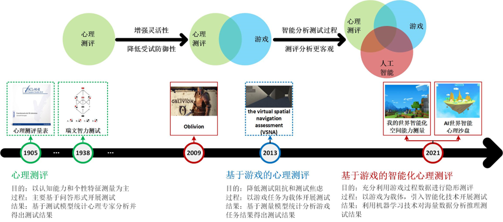

**A Review of Intelligent Psychological Assessment Based on Interactive Environment (基于交互环境的智能化心理测评)** 
[K. Huang](https://people.ucas.ac.cn/~huangkaiqi), Y. Kang, C. Yan, ***Shiyu Hu***, [L. Wang](https://people.ucas.ac.cn/~wanglg), [T. Tao](https://people.ucas.ac.cn/~0072960), [W. Gao](https://people.ucas.ac.cn/~0000893)  
*[Chinese Mental Health Journal](http://xlwszz.tgcssci.com/) (《中国心理卫生杂志》, CSSCI Journal, Top Psychological Journal in China)* 
📌 Psychological Assessment System 📌 Gamified Assessment 📌 AI4Science 

CSAI 2023

**Rethinking Similar Object Interference in Single Object Tracking** 
[Y. Wang](https://scholar.google.com.hk/citations?hl=zh-CN&user=nMe_kLAAAAAJ), ***Shiyu Hu***, [X. Zhao](https://www.xinzhaoai.com/) 
*[International Conference on Computer Science and Artificial Intelligence](http://www.csai.org/) (EI Conference, **Oral**)* 
📌 Visual Object Tracking 📌 Similar Object Interference 📌 Data Mining 
[📃 Paper](https://dl.acm.org/doi/abs/10.1145/3638584.3638644) 
[🗒 bibTex](https://huuuuusy.github.io/files/CSAI23.bib) 
[📑 PDF](https://huuuuusy.github.io/files/CSAI23.pdf)

## Preprint

Preprint
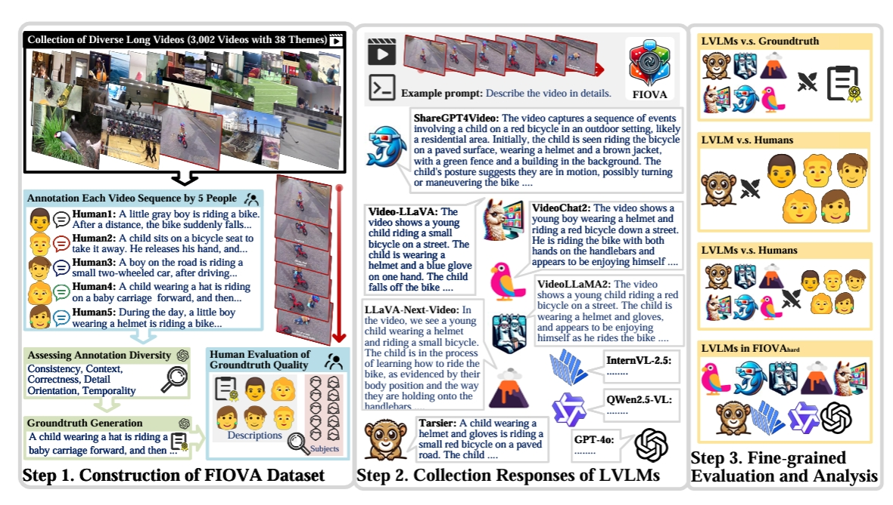

**FIOVA: A Multi-Annotator Benchmark for Human-Aligned Video Captioning** 
***Shiyu Hu***\*, [X. Li\*](https://github.com/Xuchen-Li), [X. Li](https://github.com/XuzhaoLi), J. Zhang, [Y. Wang](https://scholar.google.com.hk/citations?hl=zh-CN&user=nMe_kLAAAAAJ), [X. Zhao](https://www.xinzhaoai.com/), [K. Cheong](https://dr.ntu.edu.sg/cris/rp/rp02319) (*Equal Contributions) 
📌 Large Vision-Language Models 📌 Video Caption 📌 Video Understanding 
[📃 Paper](https://arxiv.org/abs/2410.15270) 
[📑 PDF](https://arxiv.org/pdf/2410.15270) 
[🌐 Project](https://huuuuusy.github.io/fiova/) 
<!-- [🗒 bibTex](https://huuuuusy.github.io/files/FIOVA.bib)  -->

Preprint

**Students Rather Than Experts: A New AI for Education Pipeline to Model More Human-like and Personalised Early Adolescences** 
Y. Ma\*, ***Shiyu Hu***\*, [X. Li](https://github.com/Xuchen-Li), [Y. Wang](https://scholar.google.com.hk/citations?hl=zh-CN&user=nMe_kLAAAAAJ), [S. Liu](https://faculty.ecnu.edu.cn/_s8/lsq/main.psp), [K. Cheong](https://dr.ntu.edu.sg/cris/rp/rp02319)  (*Equal Contributions)   
📌 AI4Education 📌 LLMs 📌 LLM-based Agent 
[📃 Paper](https://arxiv.org/abs/2410.15701) 
[🗒 bibTex](https://huuuuusy.github.io/files/SOE.bib) 
[📑 PDF](https://arxiv.org/pdf/2410.15701) 
[🌐 Project](https://marsgemini.github.io/SOE-LVSA/) 

Preprint
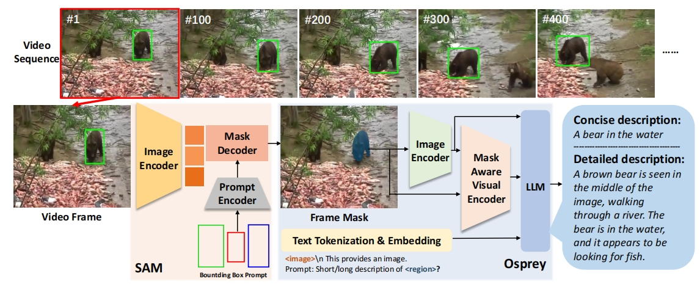

**DTVLT: A Multi-modal Diverse Text Benchmark for Visual Language Tracking Based on LLM** 
[X. Li](https://github.com/Xuchen-Li), ***Shiyu Hu***, [X. Feng](https://scholar.google.com.hk/citations?user=NqXtIPIAAAAJ), [D. Zhang](https://scholar.google.com.hk/citations?user=ApH4wOcAAAAJ), [M. Wu](https://scholar.google.com.hk/citations?user=fGc7NVAAAAAJ), J. Zhang, [K. Huang](https://people.ucas.ac.cn/~huangkaiqi) 
📌 Visual Language Tracking 📌 Large Language Model 📌 Evaluation Technique 
[📃 Paper](https://arxiv.org/abs/2410.02492) 
[🗒 bibTex](https://huuuuusy.github.io/files/DTVLT.bib) 
[📑 PDF](https://arxiv.org/pdf/2410.02492) 
[🌐 Project](http://videocube.aitestunion.com/) 

Preprint
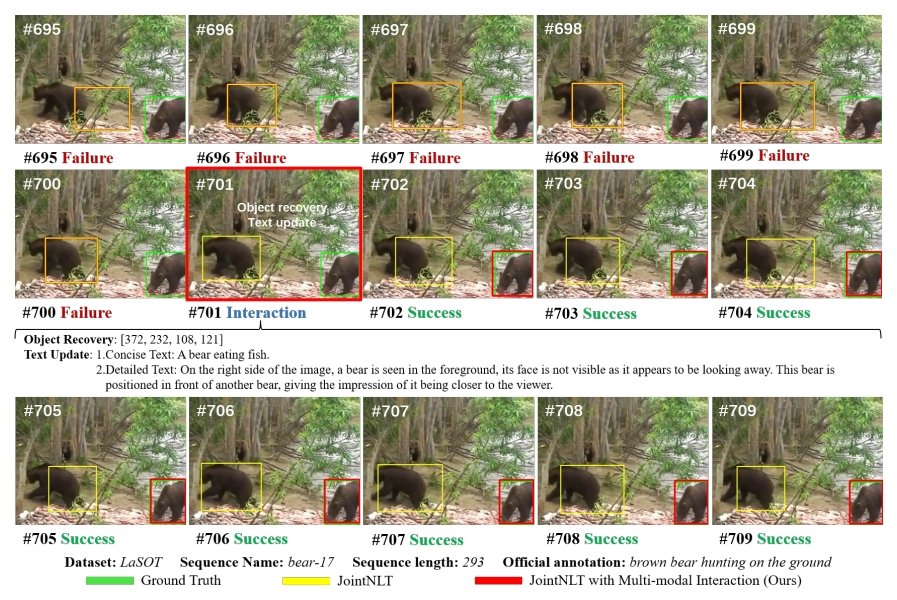

**Visual Language Tracking with Multi-modal Interaction: A Robust Benchmark** 
[X. Li](https://github.com/Xuchen-Li),  ***Shiyu Hu***, [X. Feng](https://scholar.google.com.hk/citations?user=NqXtIPIAAAAJ), [D. Zhang](https://scholar.google.com.hk/citations?user=ApH4wOcAAAAJ), [M. Wu](https://scholar.google.com.hk/citations?user=fGc7NVAAAAAJ), J. Zhang, [K. Huang](https://people.ucas.ac.cn/~huangkaiqi)  
📌 Visual Language Tracking 📌 Multi-modal Interaction 📌 Evaluation Technology 
[📃 Paper](https://arxiv.org/abs/2409.08887) 
[🗒 bibTex](https://huuuuusy.github.io/files/VLT-MI.bib) 
[📑 PDF](https://arxiv.org/pdf/2409.08887) 
[🌐 Project](http://videocube.aitestunion.com/) 

Preprint

**Nearing or Surpassing: Overall Evaluation of Human-Machine Dynamic Vision Ability** 
***Shiyu Hu***, [X. Zhao](https://www.xinzhaoai.com/), [Y. Wang](https://scholar.google.com.hk/citations?hl=zh-CN&user=nMe_kLAAAAAJ), [Y. Shan](https://scholar.google.com/citations?user=_nc83HsAAAAJ), [K. Huang](https://people.ucas.ac.cn/~huangkaiqi)  
📌 Visual Object Tracking 📌 Intelligent Evaluation Technique 📌 AI4Science 
[📑 PDF](https://huuuuusy.github.io/files/VTT-ICLR.pdf)
[🗒 bibTex](https://huuuuusy.github.io/files/VTT-ICLR.bib) 

<!-- ## Under Review

TCSVT 2024

**Target or Distractor? Rethinking Similar Object Interference in Single Object Tracking** 
[Y. Wang](https://scholar.google.com.hk/citations?hl=zh-CN&user=nMe_kLAAAAAJ), ***Shiyu Hu***, [D. Zhang](https://scholar.google.com.hk/citations?user=ApH4wOcAAAAJ), [M. Wu](https://scholar.google.com.hk/citations?user=fGc7NVAAAAAJ), [T. Yao](http://tingyao.deepfun.club/), [Y. Wang](https://scholar.google.com/citations?user=3nMDEBYAAAAJ), [L. Chen](https://sie.bit.edu.cn/szdw/jsml/ldjsyjsj/zgzcl/06c26b3ebaae4db981aaa388c660c8b5.htm), [X. Zhao](https://www.xinzhaoai.com/)  
*[IEEE Transactions on Circuits and Systems for Video Technology](https://ieeexplore.ieee.org/xpl/RecentIssue.jsp?punumber=76) (CCF-B Journal, Under Review)* 
📌 Visual Object Tracking 📌 Similar Object Interference 📌 Data Mining 

CCF-A 2024
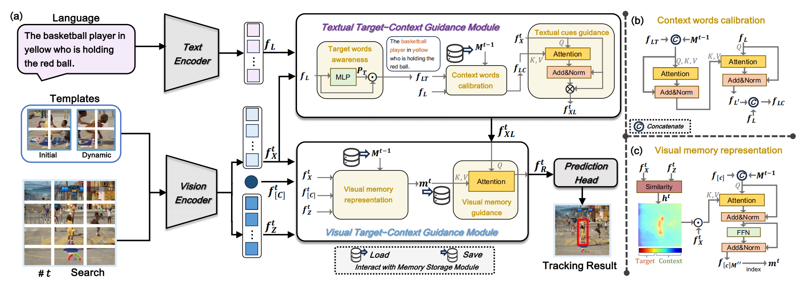

**ATCTrack: Leveraging Aligned Target-Context Cues for Robust Vision-Language Tracking** 
[X. Feng](https://scholar.google.com.hk/citations?user=NqXtIPIAAAAJ), ***Shiyu Hu***, [X. Li](https://github.com/Xuchen-Li), [D. Zhang](https://scholar.google.com.hk/citations?user=ApH4wOcAAAAJ), [M. Wu](https://scholar.google.com.hk/citations?user=fGc7NVAAAAAJ), J. Zhang, X. Chen, [K. Huang](https://people.ucas.ac.cn/~huangkaiqi) 
Submitted to a CCF-A conference, under review 
📌 Visual Language Tracking 📌 Multi-modal Alignment 📌 Feature Awareness 

CCF-A 2024
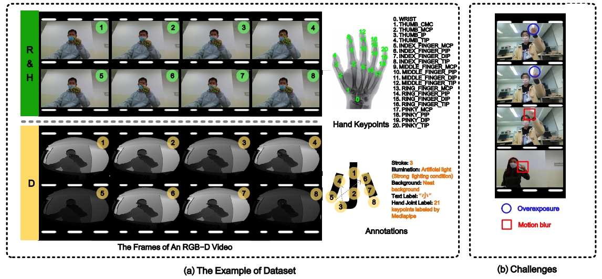

**Unconstrained Multimodal Air-Writing Benchmark: Writing by Moving Your Fingers in 3D** 
[M. Wu](https://scholar.google.com.hk/citations?user=fGc7NVAAAAAJ), [X. Li](https://github.com/Xuchen-Li), ***Shiyu Hu***, [Y. Cai](https://teacher.bupt.edu.cn/caiyuanqiang/zh_CN/index.htm), [K. Huang](https://people.ucas.ac.cn/~huangkaiqi), [W. Wang](https://people.ucas.ac.cn/~wqwang?language=en)  
Submitted to a CCF-A conference, under review 
📌 Air-writing Technique 📌 Benchmark Construction 📌 Human-machine Interaction 

心理学报 2024

**Intelligent Psychological Assessment with Sandplay based on Evidence-Centered Design Theory (基于证据中心设计理论的智能心理沙盘测评系统)** 
Y. Ren, [X. Feng](https://scholar.google.com.hk/citations?user=NqXtIPIAAAAJ), ***Shiyu Hu***, Y. Kang, C. Yan, Y. Zeng, [L. Wang](https://people.ucas.ac.cn/~wanglg), [K. Huang](https://people.ucas.ac.cn/~huangkaiqi)   
*[Acta Psychologica Sinica](https://journal.psych.ac.cn/xlxb/CN/0439-755X/home.shtml) (《心理学报》, CSSCI Journal, Top-1 Psychological Journal in China, Under Review)* 
📌 Psychological Assessment System 📌 Gamified Assessment 📌 AI4Science 

 -->