# 📝 Publications

## Book

Springer 2025

**Visual Object Tracking: An Evaluation Perspective** 
[X. Zhao](https://www.xinzhaoai.com/), ***Shiyu Hu***,  [X. Yin](https://scce.ustb.edu.cn/shiziduiwu/jiaoshixinxi/2018-04-12/62.html) 
[Springer, Part of the book series: Advances in Computer Vision and Pattern Recognition (ACVPR)](https://www.springer.com/series/4205) 
📌 Visual Object Tracking 📌 Intelligent Evaluation Technology  
[📃 Book](https://link.springer.com/book/9789819645572)

## Accept

### First Author / Corresponding Author
<!-- 代表作按照固定顺序排列 -->

TPAMI 2023

**Global Instance Tracking: Locating Target More Like Humans** 
***Shiyu Hu***, [X. Zhao](https://www.xinzhaoai.com/), [L. Huang](https://github.com/huanglianghua), [K. Huang](https://people.ucas.ac.cn/~huangkaiqi) 
[IEEE Transactions on Pattern Analysis and Machine Intelligence](https://ieeexplore.ieee.org/xpl/RecentIssue.jsp?punumber=34) (CCF-A Journal) 
📌 Visual Object Tracking 📌 Large-scale Benchmark Construction 📌 Intelligent Evaluation Technology  
[📃 Paper](https://ieeexplore.ieee.org/document/9720246/)
[📑 PDF](https://huuuuusy.github.io/files/GIT.pdf)
[🪧 Poster](https://huuuuusy.github.io/files/VALSE24Poster-364.pdf)
[🌐 Platform](http://videocube.aitestunion.com/)
[🔧 Toolkit](https://github.com/huuuuusy/videocube-toolkit) 
[💾 Dataset](http://videocube.aitestunion.com/downloads)

IJCV 2024

**SOTVerse: A User-defined Task Space of Single Object Tracking** 
***Shiyu Hu***, [X. Zhao](https://www.xinzhaoai.com/), [K. Huang](https://people.ucas.ac.cn/~huangkaiqi) 
[International Journal of Computer Vision](https://www.springer.com/journal/11263) (CCF-A Journal) 
📌 Visual Object Tracking 📌 Dynamic Open Environment Construction 📌 3E Paradigm 
[📃 Paper](https://link.springer.com/article/10.1007/s11263-023-01908-5)
[📑 PDF](https://huuuuusy.github.io/files/SOTVerse.pdf)
[🪧 Poster](https://huuuuusy.github.io/files/VALSE25Poster-G19.jpg)
[🌐 Platform](http://metaverse.aitestunion.com/) 

IJCV 2024

**BioDrone: A Bionic Drone-based Single Object Tracking Benchmark for Robust Vision** 
[X. Zhao](https://www.xinzhaoai.com/), ***Shiyu Hu✉️***, [Y. Wang](https://scholar.google.com.hk/citations?hl=zh-CN&user=nMe_kLAAAAAJ), J. Zhang, Y. Hu, R. Liu, [H. Lin](https://www3.cs.stonybrook.edu/~hling/), [Y. Li](https://www.biostat.wisc.edu/~yli/), R. Li, K. Liu, [J. Li](http://yjsb.sinano.ac.cn/Doctor/info.aspx?itemid=920)  
[International Journal of Computer Vision](https://www.springer.com/journal/11263) (CCF-A Journal) 
📌 Visual Object Tracking 📌 Drone-based Tracking 📌 Visual Robustness 
[📃 Paper](https://link.springer.com/article/10.1007/s11263-023-01937-0)
[🌐 Platform](http://biodrone.aitestunion.com/) 
[📑 PDF](https://huuuuusy.github.io/files/BioDrone.pdf)
[🔧 Toolkit](https://github.com/huuuuusy/biodrone-toolkit-official) 
[💾 Dataset](http://biodrone.aitestunion.com/downloads) 

NeurIPS 2023

**A Multi-modal Global Instance Tracking Benchmark (MGIT): Better Locating Target in Complex Spatio-temporal and causal Relationship** 
***Shiyu Hu***, [D. Zhang](https://scholar.google.com.hk/citations?user=ApH4wOcAAAAJ), [M. Wu](https://scholar.google.com.hk/citations?user=fGc7NVAAAAAJ), [X. Feng](https://scholar.google.com.hk/citations?user=NqXtIPIAAAAJ), [X. Li](https://github.com/Xuchen-Li), [X. Zhao](https://www.xinzhaoai.com/), [K. Huang](https://people.ucas.ac.cn/~huangkaiqi) 
[Conference on Neural Information Processing Systems](https://neurips.cc/Conferences/2023) (CCF-A Conference, Poster) 
📌 Visual Language Tracking 📌 Long Video Understanding and Reasoning 📌 Hierarchical Semantic Information Annotation 
[📃 Paper](https://proceedings.nips.cc/paper_files/paper/2023/hash/4ea14e6090343523ddcd5d3ca449695f-Abstract-Datasets_and_Benchmarks.html) 
[📃 PDF](https://huuuuusy.github.io/files/MGIT.pdf)
[🪧 Poster](https://huuuuusy.github.io/files/MGIT-poster.pdf)
[📹 Slides](https://huuuuusy.github.io/files/MGIT-Slides.pdf)
[🌐 Platform](http://videocube.aitestunion.com/)
[🔧 Toolkit](https://github.com/huuuuusy/videocube-toolkit) 
[💾 Dataset](http://videocube.aitestunion.com/downloads)

ICCV 2025

**ATCTrack: Aligning Target-Context Cues with Dynamic Target States for Robust Vision-Language Tracking** 
[X. Feng\*](https://scholar.google.com.hk/citations?user=NqXtIPIAAAAJ), ***Shiyu Hu***\*, [X. Li](https://github.com/Xuchen-Li), [D. Zhang](https://scholar.google.com.hk/citations?user=ApH4wOcAAAAJ), [M. Wu](https://scholar.google.com.hk/citations?user=fGc7NVAAAAAJ), J. Zhang, X. Chen, [K. Huang](https://people.ucas.ac.cn/~huangkaiqi) (*Equal Contributions)  
[International Conference on Computer Vision](https://iccv.thecvf.com/) (CCF-A Conference, **Highlight**) 
📌 Visual Language Tracking 📌 Multimodal Learning 📌 Adaptive Prompts 
[📃 Paper](https://arxiv.org/abs/2507.19875)
[📑 PDF](https://arxiv.org/pdf/2507.19875)

ICRA 2026
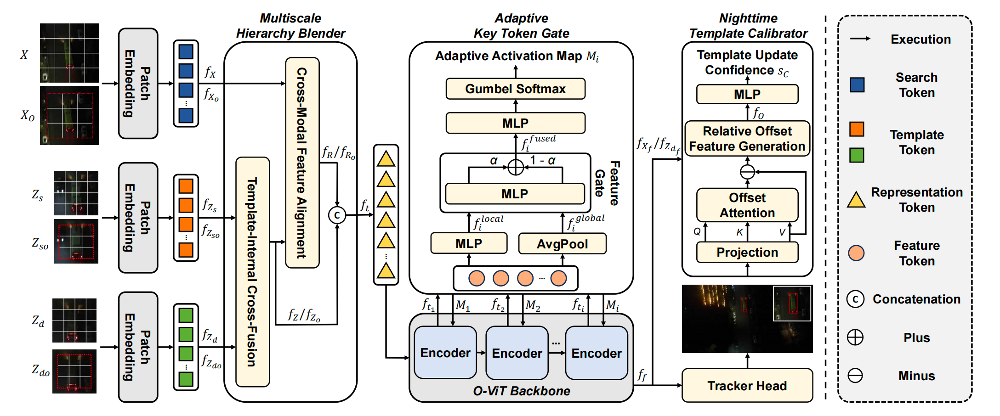

**MATrack: Efficient Multiscale Adaptive Tracker for Real-Time Nighttime UAV Operations** 
[X. Li\*](https://github.com/XuzhaoLi), [X. Li\*](https://github.com/Xuchen-Li), ***Shiyu Hu✉️*** 
[International Conference on Robotics and Automation](https://2026.ieee-icra.org/) (CAAI-A Conference) 
📌 Nighttime UAVs Tracking 📌 Multiscale Adaptive Tracker 📌 Visual Object Tracking  
[📃 Paper](https://arxiv.org/abs/2510.21586)
[📑 PDF](https://arxiv.org/pdf/2510.21586)

ICMR 2025

**DARTer: Dynamic Adaptive Representation Tracker for Nighttime UAV Tracking** 
[X. Li\*](https://github.com/XuzhaoLi), [X. Li\*](https://github.com/Xuchen-Li), ***Shiyu Hu✉️*** 
[International Conference on Multimedia Retrieval](https://www.icmr-2025.org/) (CCF-B Conference) 
📌 Nighttime UAVs Tracking 📌 Dark Feature Blending 📌 Dynamic Feature Activation  
[📃 Paper](https://dl.acm.org/doi/abs/10.1145/3731715.3733473)
[📑 PDF](https://dl.acm.org/doi/pdf/10.1145/3731715.3733473)

中国图象图形学报 2023

**Visual Intelligence Evaluation Techniques for Single Object Tracking: A Survey (单目标跟踪中的视觉智能评估技术综述)** 
***Shiyu Hu***, [X. Zhao](https://www.xinzhaoai.com/), [K. Huang](https://people.ucas.ac.cn/~huangkaiqi) 
[Journal of Images and Graphics](http://www.cjig.cn/jig/ch/index.aspx) (《中国图象图形学报》, CCF-B Chinese Journal) 
📌 Visual Object Tracking 📌 Intelligent Evaluation Technique 📌 AI4Science 
[📃 Paper](http://www.cjig.cn/jig/ch/reader/view_abstract.aspx?flag=2&file_no=202307100000002&journal_id=jig) 
[📑 PDF](https://huuuuusy.github.io/files/JIG-survey.pdf) 

IET-CVI 2025

**Improved SAR Aircraft Detection Algorithm Based on Visual State Space Models** 
Y. Wang, J. Zhang, [Y. Wang](https://scholar.google.com.hk/citations?hl=zh-CN&user=nMe_kLAAAAAJ), ***Shiyu Hu✉️***, B. Shen, Z. Hou, [W. Zhou](https://scholar.google.com/citations?user=r8x76hUAAAAJ) 
[IET Computer Vision](https://digital-library.theiet.org/journal/iet-cvi) (CCF-C Journal) 
📌 Synthetic Aperture Radar 📌 State Space Models 📌 Aircraft Object Detection  
<!-- [📃 Paper](https://www.arxiv.org/abs/2505.00752) -->
<!-- [📑 PDF](https://www.arxiv.org/pdf/2505.00752) -->

### Collaborator (Arranged in Chronological Order)

<!-- 合作论文按时间顺序排列 -->

AAAI 2026
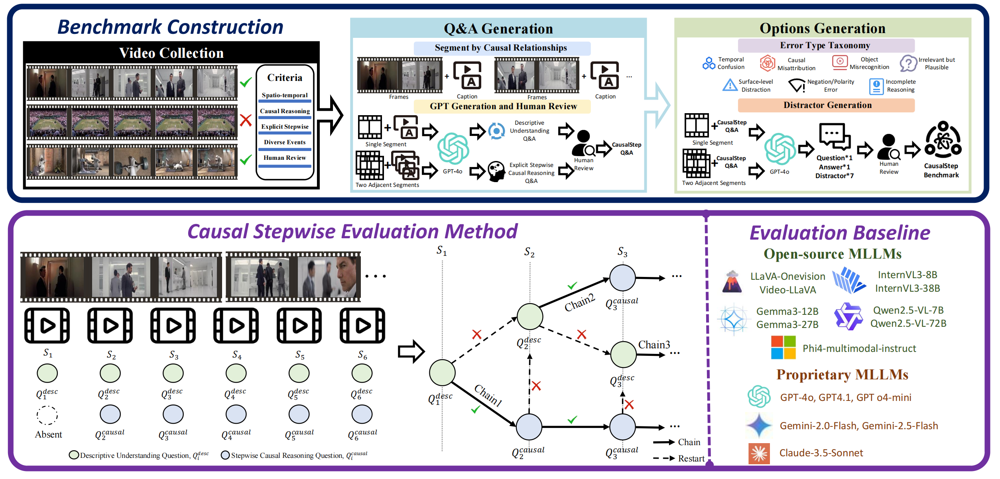

**CausalStep: A Benchmark for Explicit Stepwise Causal Reasoning in Videos** 
[X. Li\*](https://github.com/Xuchen-Li), [X. Li\*](https://github.com/XuzhaoLi), ***Shiyu Hu***, [K. Huang](https://people.ucas.ac.cn/~huangkaiqi), [W. Zhang](https://zwt233.github.io/) 
[Proceedings of the AAAI Conference on Artificial Intelligence](https://aaai.org/conference/aaai/aaai-26/) (CCF-A Conference, **Oral**) 
📌 Video-based QA 📌 Video Reasoning 📌 Video Understanding  
[📃 Paper](https://arxiv.org/abs/2507.16878)
[📑 PDF](https://arxiv.org/pdf/2507.16878)
[📹 Slides](https://huuuuusy.github.io/files/CausalStep-Slides.pdf)

AAAI 2026
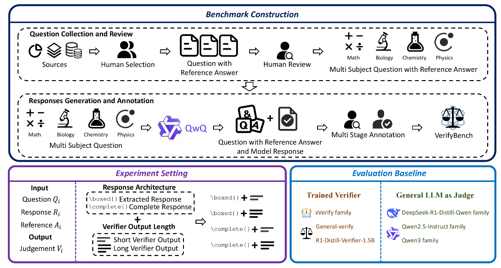

**VerifyBench: A Systematic Benchmark for Evaluating Reasoning Verifiers Across Domains** 
[X. Li\*](https://github.com/XuzhaoLi), [X. Li\*](https://github.com/Xuchen-Li), ***Shiyu Hu***, [Y. Guo](https://openreview.net/profile?id=~yongzhen.gyz1), [W. Zhang](https://zwt233.github.io/) 
[Proceedings of the AAAI Conference on Artificial Intelligence](https://aaai.org/conference/aaai/aaai-26/) (CCF-A Conference, **Oral**) 
📌 Verifable Reward 📌 Reinforcement Learning  
[📃 Paper](https://arxiv.org/abs/2507.09884)
[📑 PDF](https://arxiv.org/pdf/2507.09884)
[📹 Slides](https://huuuuusy.github.io/files/VerifyBench-Slides.pdf)

ICLR 2026
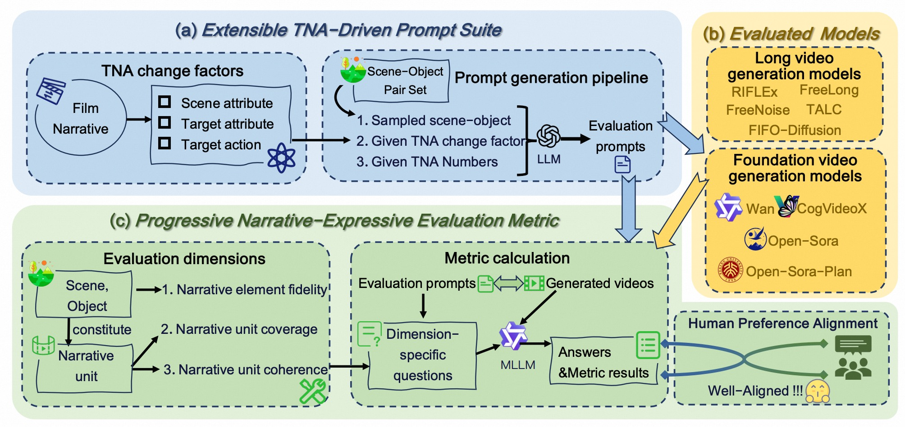

**NarrLV: Towards a Comprehensive Narrative-Centric Evaluation for Long Video Generation Models** 
[X. Feng](https://scholar.google.com.hk/citations?user=NqXtIPIAAAAJ), H. Yu, [M. Wu](https://scholar.google.com.hk/citations?user=fGc7NVAAAAAJ), ***Shiyu Hu***, J. Chen, C. Zhu, J. Wu, [X. Chu](https://cxxgtxy.github.io/), [K. Huang](https://people.ucas.ac.cn/~huangkaiqi) 
📌 Visual Understanding 📌 Video Generation 📌 Evaluation Technique 
[📃 Paper](https://arxiv.org/abs/2507.11245) 
[📑 PDF](https://arxiv.org/pdf/2507.11245) 

ICML 2025

**CSTrack: Enhancing RGB-X Tracking via Compact Spatiotemporal Features** 
[X. Feng](https://scholar.google.com.hk/citations?user=NqXtIPIAAAAJ), [D. Zhang](https://scholar.google.com.hk/citations?user=ApH4wOcAAAAJ), ***Shiyu Hu***, [X. Li](https://github.com/Xuchen-Li), [M. Wu](https://scholar.google.com.hk/citations?user=fGc7NVAAAAAJ), J. Zhang, X. Chen, [K. Huang](https://people.ucas.ac.cn/~huangkaiqi)   
[International Conference on Machine Learning](https://icml.cc/) (CCF-A Conference, Poster) 
📌 Visual Object Tracking 📌 Multi-modal Learning  
[📃 Paper](https://openreview.net/forum?id=JZIJxr9KsO)
[📑 PDF](https://openreview.net/pdf?id=JZIJxr9KsO5)

ICASSP 2025

**Enhancing Vision-Language Tracking by Effectively Converting Textual Cues into Visual Cues** 
[X. Feng](https://scholar.google.com.hk/citations?user=NqXtIPIAAAAJ), [D. Zhang](https://scholar.google.com.hk/citations?user=ApH4wOcAAAAJ), ***Shiyu Hu***, [X. Li](https://github.com/Xuchen-Li),  [M. Wu](https://scholar.google.com.hk/citations?user=fGc7NVAAAAAJ), J. Zhang, X. Chen, [K. Huang](https://people.ucas.ac.cn/~huangkaiqi)  
[IEEE International Conference on Acoustics, Speech, and Signal Processing](https://2025.ieeeicassp.org/) (CCF-B Conference, Poster) 
📌 Visual Language Tracking 📌 Multi-modal Learning 📌 Grounding Model 
[📃 Paper](https://ieeexplore.ieee.org/document/10888064) 
[📃 PDF](https://arxiv.org/pdf/2412.19648)

C&E:AI 2025
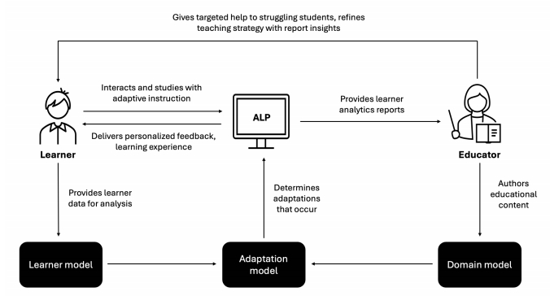

**Artificial Intelligence-Enabled Adaptive Learning Platforms: A Review** 
L. Tan, ***Shiyu Hu***, [Darren J. Yeo](https://dr.ntu.edu.sg/cris/rp/rp01327), [KH Cheong](https://dr.ntu.edu.sg/cris/rp/rp02319)  
[Computers & Education: Artificial Intelligence](https://www.sciencedirect.com/journal/computers-and-education-artificial-intelligence) 
📌 Adaptive Learning Platforms 📌 AI for Education 📌 Educational Technology 
[📃 Paper](https://www.sciencedirect.com/science/article/pii/S2666920X25000694) 
[📑 PDF](https://www.sciencedirect.com/science/article/pii/S2666920X25000694/pdfft?md5=78d8390b2042b0b007698f2e3db4fe76&pid=1-s2.0-S2666920X25000694-main.pdf)

Mathematics 2025
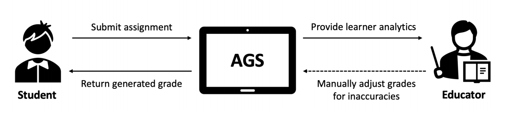

**A Comprehensive Review on Automated Grading Systems in STEM Using AI Techniques** 
L. Tan, ***Shiyu Hu***, [Darren J. Yeo](https://dr.ntu.edu.sg/cris/rp/rp01327), [KH Cheong](https://dr.ntu.edu.sg/cris/rp/rp02319)  
[Mathematics](https://www.sciencedirect.com/journal/computers-and-education-artificial-intelligence) 
📌 Automated Grading Systems 📌 AI for Education 📌 Educational Technology 
[📃 Paper](https://www.mdpi.com/2227-7390/13/17/2828) 
<!-- [📑 PDF](https://www.sciencedirect.com/science/article/pii/S2666920X25000694/pdfft?md5=78d8390b2042b0b007698f2e3db4fe76&pid=1-s2.0-S2666920X25000694-main.pdf) -->

Innovation and Emerging Technologies 2025
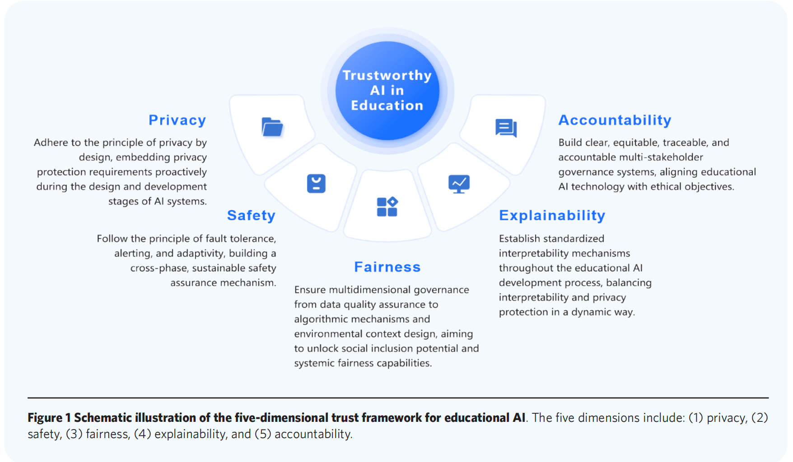

**Trustworthy AI in education: Framework, cases, and governance strategies** 
Y. Ma, X. Li, ***Shiyu Hu***, [S. Liu](https://faculty.ecnu.edu.cn/_s8/lsq/main.psp), [KH Cheong](https://dr.ntu.edu.sg/cris/rp/rp02319)   
[Innovation and Emerging Technologies](https://www.worldscientific.com/worldscinet/iet?cmpid=6350db6df59e5b0001f79b4b) 
📌 Trustworthy Artificial Intelligence 📌 Educational Governance 📌 Algorithmic Fairness; 
[📃 Paper](https://www.worldscientific.com/doi/abs/10.1142/S2737599425500264) 
<!-- [📑 PDF](https://www.sciencedirect.com/science/article/pii/S2666920X25000694/pdfft?md5=78d8390b2042b0b007698f2e3db4fe76&pid=1-s2.0-S2666920X25000694-main.pdf) -->

中国心理卫生杂志 2025

**A Review of Intelligent Psychological Assessment Based on Interactive Environment (基于交互环境的智能化心理测评)** 
[K. Huang](https://people.ucas.ac.cn/~huangkaiqi), Y. Kang, C. Yan, ***Shiyu Hu***, [L. Wang](https://people.ucas.ac.cn/~wanglg), [T. Tao](https://people.ucas.ac.cn/~0072960), [W. Gao](https://people.ucas.ac.cn/~0000893)  
[Chinese Mental Health Journal](http://xlwszz.tgcssci.com/) (《中国心理卫生杂志》, CSSCI Journal, Top Psychological Journal in China) 
📌 Psychological Assessment System 📌 Gamified Assessment 📌 AI4Science 

NeurIPS 2024

**Beyond Accuracy: Tracking more like Human via Visual Search** 
[D. Zhang](https://scholar.google.com.hk/citations?user=ApH4wOcAAAAJ), ***Shiyu Hu***, [X. Feng](https://scholar.google.com.hk/citations?user=NqXtIPIAAAAJ), [X. Li](https://github.com/Xuchen-Li), [M. Wu](https://scholar.google.com.hk/citations?user=fGc7NVAAAAAJ), J. Zhang, [K. Huang](https://people.ucas.ac.cn/~huangkaiqi)   
[Conference on Neural Information Processing Systems](https://neurips.cc/Conferences/2024) (CCF-A Conference, Poster) 
📌  Visual Object Tracking 📌 Visual Search Mechanism 📌 Visual Turing Test 
[📃 Paper](https://proceedings.neurips.cc/paper_files/paper/2024/hash/050f8591be3874b52fdac4e1060eeb29-Abstract-Conference.htmlO)
[📑 PDF](https://proceedings.neurips.cc/paper_files/paper/2024/file/050f8591be3874b52fdac4e1060eeb29-Paper-Conference.pdf)

NeurIPS 2024

**MemVLT: Vision-Language Tracking with Adaptive Memory-based Prompts** 
[X. Feng](https://scholar.google.com.hk/citations?user=NqXtIPIAAAAJ), [X. Li](https://github.com/Xuchen-Li), ***Shiyu Hu***, [D. Zhang](https://scholar.google.com.hk/citations?user=ApH4wOcAAAAJ), [M. Wu](https://scholar.google.com.hk/citations?user=fGc7NVAAAAAJ), J. Zhang, X. Chen, [K. Huang](https://people.ucas.ac.cn/~huangkaiqi)   
[Conference on Neural Information Processing Systems](https://neurips.cc/Conferences/2024) (CCF-A Conference, Poster) 
📌 Visual Language Tracking 📌 Human-like Memory Modeling 📌 Adaptive Prompts 
[📃 Paper](https://neurips.cc/virtual/2024/poster/94643)
[📑 PDF](https://proceedings.neurips.cc/paper_files/paper/2024/file/1af3e0bf5905e33789979f666c31192d-Paper-Conference.pdf)

ICASSP 2024

**Robust Single-particle Cryo-EM Image Denoising and Restoration** 
J. Zhang, T. Zhao, ***Shiyu Hu***, [X. Zhao](https://www.xinzhaoai.com/) 
[IEEE International Conference on Acoustics, Speech, and Signal Processing](https://2024.ieeeicassp.org/) (CCF-B Conference, Poster) 
📌 Medical Image Processing 📌 AI4Science 📌 Diffusion Model 
[📃 Paper](https://ieeexplore.ieee.org/abstract/document/10447135) 
[📑 PDF](https://huuuuusy.github.io/files/ICASSP24.pdf)

TCSVT 2024

**Finger in Camera Speaks Everything: Unconstrained Air-Writing for Real-World** 
[M. Wu](https://scholar.google.com.hk/citations?user=fGc7NVAAAAAJ), [K. Huang](https://people.ucas.ac.cn/~huangkaiqi), [Y. Cai](https://teacher.bupt.edu.cn/caiyuanqiang/zh_CN/index.htm), ***Shiyu Hu***, [Y. Zhao](https://callsys.github.io/zhaoyuzhong.github.io-main/), [W. Wang](https://people.ucas.ac.cn/~wqwang?language=en)  
[IEEE Transactions on Circuits and Systems for Video Technology](https://ieeexplore.ieee.org/xpl/RecentIssue.jsp?punumber=76) (CCF-B Journal) 
📌 Air-writing Technique 📌 Benchmark Construction 📌 Human-machine Interaction 
[📃 Paper](https://ieeexplore.ieee.org/document/10496279) 
[📃 PDF](https://huuuuusy.github.io/files/AWCV100k.pdf)
[🔧 Toolkit](https://github.com/wmeiqi/AWCV) 

PRCV 2024

**VS-LLM: Visual-Semantic Depression Assessment based on LLM for Drawing Projection Test** 
[M. Wu](https://scholar.google.com.hk/citations?user=fGc7NVAAAAAJ), Y. Kang, [X. Li](https://github.com/Xuchen-Li), ***Shiyu Hu***, X. Chen, Y. kang, [W. Wang](https://people.ucas.ac.cn/~wqwang?language=en), [K. Huang](https://people.ucas.ac.cn/~huangkaiqi)  
[Chinese Conference on Pattern Recognition and Computer Vision](https://www.prcv.cn) (CCF-C Conference) 
📌 Psychological Assessment System 📌 Gamified Assessment 📌 AI4Science 
[📃 Paper](https://link.springer.com/chapter/10.1007/978-981-97-8692-3_17) 
[📃 PDF](https://huuuuusy.github.io/files/VSLLM.pdf)

PRCV 2023

**A Hierarchical Theme Recognition Model for Sandplay Therapy** 
[X. Feng](https://scholar.google.com.hk/citations?user=NqXtIPIAAAAJ), ***Shiyu Hu***, X. Chen, [K. Huang](https://people.ucas.ac.cn/~huangkaiqi) 
[Chinese Conference on Pattern Recognition and Computer Vision](https://www.prcv2023.cn/2023prcv) (CCF-C Conference, Poster) 
📌 Psychological Assessment System 📌 Gamified Assessment 📌 AI4Science 
[📃 Paper](https://link.springer.com/chapter/10.1007/978-981-99-8462-6_20) 
[📑 PDF](https://huuuuusy.github.io/files/PRCV23.pdf)
[🔖 Supplementary](https://huuuuusy.github.io/files/PRCV23-Supp.pdf)
[🪧 Poster](https://huuuuusy.github.io/files/PRCV23-poster.pdf)

CSAI 2023

**Rethinking Similar Object Interference in Single Object Tracking** 
[Y. Wang](https://scholar.google.com.hk/citations?hl=zh-CN&user=nMe_kLAAAAAJ), ***Shiyu Hu***, [X. Zhao](https://www.xinzhaoai.com/) 
[International Conference on Computer Science and Artificial Intelligence](http://www.csai.org/) (EI Conference, **Oral**) 
📌 Visual Object Tracking 📌 Similar Object Interference 📌 Data Mining 
[📃 Paper](https://dl.acm.org/doi/abs/10.1145/3638584.3638644) 
[🗒 bibTex](https://huuuuusy.github.io/files/CSAI23.bib) 
[📑 PDF](https://huuuuusy.github.io/files/CSAI23.pdf)

Neurocomputing 2022

**Revisiting Instance Search: A New Benchmark Using Cycle Self-training** 
[Y. Zhang](https://wesleyzhang1991.github.io/), [C. Liu](https://scholar.google.com/citations?user=atOfOgMAAAAJ&hl=zh-CN&oi=sra), [W. Chen](https://scholar.google.com/citations?user=KWVlYaMAAAAJ&hl=zh-CN&oi=sra), [X. Xu](https://scholar.google.com/citations?user=nJc6BvgAAAAJ&hl=zh-CN&oi=sra), [F. Wang](https://scholar.google.com/citations?user=WCRGTHsAAAAJ), [H. Li](https://scholar.google.com/citations?user=pHN-QIwAAAAJ&hl=zh-CN&oi=sra), ***Shiyu Hu***, [X. Zhao](https://www.xinzhaoai.com/) 
[Neurocomputing](https://www.sciencedirect.com/journal/neurocomputing)  (CCF-C Journal) 
📌 Video Instance Search 📌 Benchmark Construction  📌 Data Mining 
[📃 Paper](https://www.sciencedirect.com/science/article/abs/pii/S0925231222007445) 
[📑 PDF](https://huuuuusy.github.io/files/Neu22.pdf) 
[🌐 Project](https://github.com/Instance-Search/) 

图学学报 2021

**Visual Turing: The Next Development of Computer Vision in The View of Human-computer Gaming (视觉图灵：从人机对抗看计算机视觉下一步发展)** 
[K. Huang](https://people.ucas.ac.cn/~huangkaiqi), [X. Zhao](https://www.xinzhaoai.com/), [Q. Li](https://scholar.google.com/citations?user=7xmxBagAAAAJ), ***Shiyu Hu*** 
[Journal of Graphics](http://www.txxb.com.cn/CN/2095-302X/home.shtml) (《图学学报》, CCF-C Chinese Journal) 
📌 Visual Object Tracking 📌 Intelligent Evaluation Technique  📌 AI4Science 
[📃 Paper](http://www.txxb.com.cn/CN/10.11996/JG.j.2095-302X.2021030339) 
[📑 PDF](https://huuuuusy.github.io/files/VTT.pdf)

## Workshop

- ``AAAIW 2026``
**Learning to Be Taught: A Structured SOEI Framework for Modeling and Evaluating Personality-Aligned Virtual Student Agents**, 
Y. Ma\*, ***Shiyu Hu***\*, [X. Li](https://github.com/Xuchen-Li), [Y. Wang](https://scholar.google.com.hk/citations?hl=zh-CN&user=nMe_kLAAAAAJ), Y. Chen, [S. Liu](https://faculty.ecnu.edu.cn/_s8/lsq/main.psp), [KH Cheong](https://dr.ntu.edu.sg/cris/rp/rp02319)  (*Equal Contributions),
[the AI for Education Workshop in the 40th Annual AAAI Conference on Artificial Intelligence](https://ai4ed.cc/workshops/aaai2026) (Workshop in CCF-A Conference),
[📹 Slides](https://huuuuusy.github.io/files/AAAI26-AI4Edu-SOEI-Slides.pdf)

- ``AAAIW 2026``
**Redefining Educational Simulation: EduVerse as a User-Defined and Developmental Multi-Agent Simulation Space**, 
Y. Ma\*, ***Shiyu Hu***\*, B. Zhu, [Y. Wang](https://scholar.google.com.hk/citations?hl=zh-CN&user=nMe_kLAAAAAJ), Y. Kang, [S. Liu](https://faculty.ecnu.edu.cn/_s8/lsq/main.psp), [KH Cheong](https://dr.ntu.edu.sg/cris/rp/rp02319)  (*Equal Contributions), 
[the AI for Education Workshop in the 40th Annual AAAI Conference on Artificial Intelligence](https://ai4ed.cc/workshops/aaai2026) (Workshop in CCF-A Conference),
[📹 Slides](https://huuuuusy.github.io/files/AAAI26-AI4Edu-EduVerse-Slides.pdf)

- ``AAAIW 2026``
**From Objective to Subjective: A Benchmark for Virtual Student Abilities**, 
B. Zhu\*, ***Shiyu Hu***\*, Y. Ma, Y. Zhang, [KH Cheong](https://dr.ntu.edu.sg/cris/rp/rp02319) (*Equal Contributions), 
[the AI for Education Workshop in the 40th Annual AAAI Conference on Artificial Intelligence](https://ai4ed.cc/workshops/aaai2026) (Workshop in CCF-A Conference),
[📹 Slides](https://huuuuusy.github.io/files/AAAI26-AI4Edu-EduPersona-Slides.pdf)

- ``CVPRW 2024``
**Diverse Text Generation for Visual Language Tracking Based on LLM**, 
[X. Li](https://github.com/Xuchen-Li), [X. Feng](https://scholar.google.com.hk/citations?user=NqXtIPIAAAAJ), ***Shiyu Hu***, [M. Wu](https://scholar.google.com.hk/citations?user=fGc7NVAAAAAJ), [D. Zhang](https://scholar.google.com.hk/citations?user=ApH4wOcAAAAJ), J. Zhang, [K. Huang](https://people.ucas.ac.cn/~huangkaiqi), 
[the 3rd Workshop on Vision Datasets Understanding and DataCV Challenge in CVPR 2024](https://sites.google.com/view/vdu-cvpr24/) (Workshop in CCF-A Conference, **Oral, Best Paper Honorable Mention**), 
[📃 Paper](https://arxiv.org/abs/2405.12139) 
[📃 PDF](https://huuuuusy.github.io/files/DTLLM-VLT.pdf)
[🪧 Poster](https://github.com/Xuchen-Lifiles/DTLLM-poster.pdf)
[📹 Slides](https://github.com/Xuchen-Lifiles/DTLLM-Slides.pdf)
[🌐 Platform](http://videocube.aitestunion.com/)
[🔧 Toolkit](https://github.com/Xuchen-Li/DTLLM-VLT) 
[💾 Dataset](http://videocube.aitestunion.com/downloads)
[🏆 Award](https://huuuuusy.github.io/files/DTLLM-VLT-Award.pdf)

## Preprint

Preprint

**FIOVA: A Multi-Annotator Benchmark for Human-Aligned Video Captioning** 
***Shiyu Hu***\*, [X. Li\*](https://github.com/Xuchen-Li), [X. Li](https://github.com/XuzhaoLi), J. Zhang, [Y. Wang](https://scholar.google.com.hk/citations?hl=zh-CN&user=nMe_kLAAAAAJ), [X. Zhao](https://www.xinzhaoai.com/), [KH Cheong](https://dr.ntu.edu.sg/cris/rp/rp02319) (*Equal Contributions) 
📌 Large Vision-Language Models 📌 Video Caption 📌 Video Understanding 
[📃 Paper](https://arxiv.org/abs/2410.15270) 
[📑 PDF](https://arxiv.org/pdf/2410.15270) 
[🌐 Project](https://huuuuusy.github.io/fiova/) 

Preprint
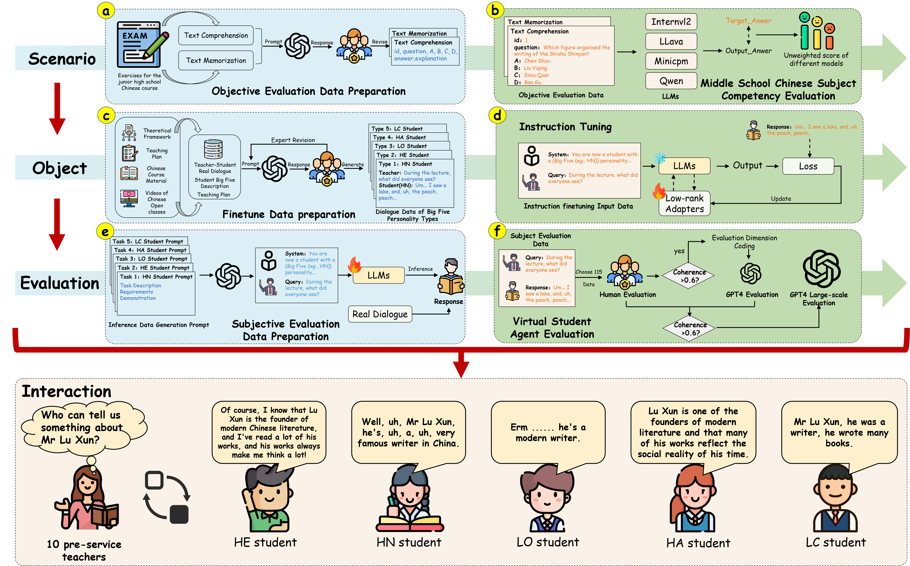

**When LLMs Learn to be Students: The SOEI Framework for Modeling and Evaluating Virtual Student Agents in Educational Interaction** 
Y. Ma\*, ***Shiyu Hu***\*, [X. Li](https://github.com/Xuchen-Li), [Y. Wang](https://scholar.google.com.hk/citations?hl=zh-CN&user=nMe_kLAAAAAJ), Y. Chen, [S. Liu](https://faculty.ecnu.edu.cn/_s8/lsq/main.psp), [KH Cheong](https://dr.ntu.edu.sg/cris/rp/rp02319)  (*Equal Contributions)   
📌 AI4Education 📌 LLMs 📌 LLM-based Agent 
[📃 Paper](https://arxiv.org/abs/2410.15701) 
[📑 PDF](https://arxiv.org/pdf/2410.15701) 

Preprint
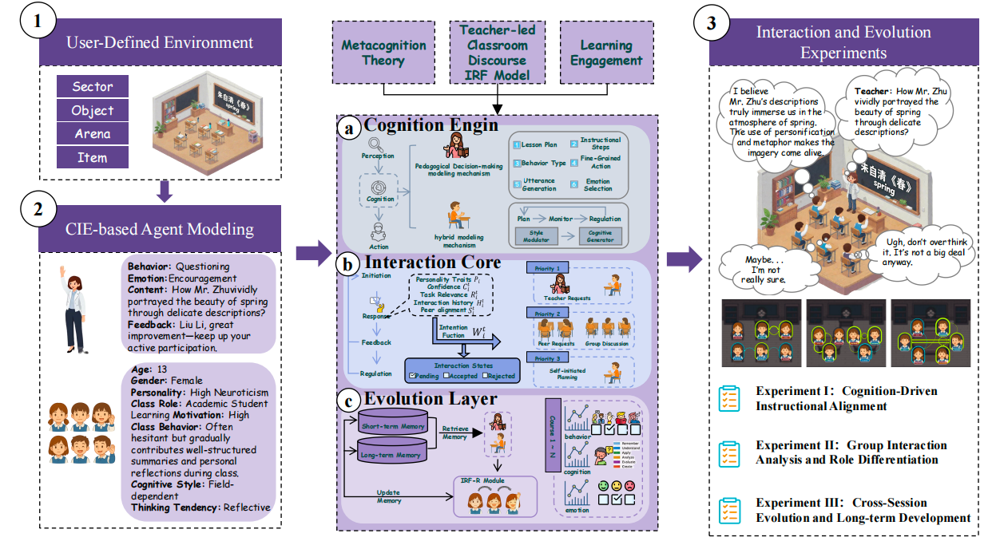

**EduVerse: A User-Defined Multi-Agent Simulation Space for Education Scenario** 
Y. Ma\*, ***Shiyu Hu***\*, B. Zhu, [Y. Wang](https://scholar.google.com.hk/citations?hl=zh-CN&user=nMe_kLAAAAAJ), Y. Kang, [S. Liu](https://faculty.ecnu.edu.cn/_s8/lsq/main.psp), [KH Cheong](https://dr.ntu.edu.sg/cris/rp/rp02319)  (*Equal Contributions)   
📌 AI4Education 📌 LLMs 📌 LLM-based Agent 
[📃 Paper](https://arxiv.org/abs/2510.05650) 
[📑 PDF](https://arxiv.org/pdf/2510.05650) 

Preprint
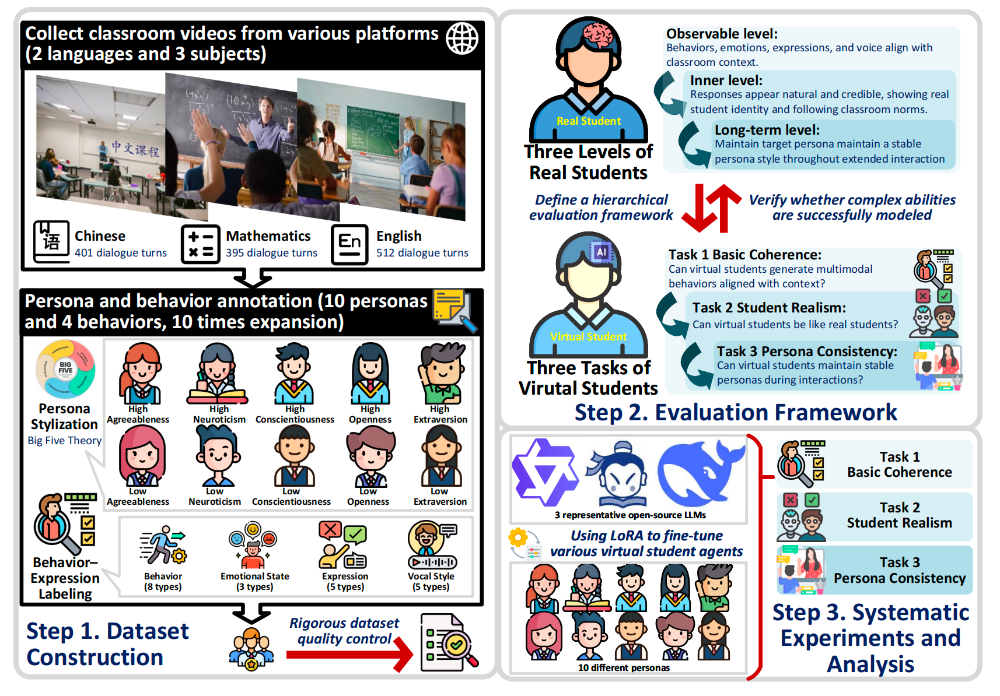

**EduPersona: Benchmarking Subjective Ability Boundaries of Virtual Student Agents** 
B. Zhu\*, ***Shiyu Hu***\*, Y. Ma, Y. Zhang, [KH Cheong](https://dr.ntu.edu.sg/cris/rp/rp02319)  (*Equal Contributions)   
📌 AI4Education 📌 LLMs 📌 LLM-based Agent 
[📃 Paper](https://arxiv.org/abs/2510.04648) 
[📑 PDF](https://arxiv.org/pdf/2510.04648) 

Preprint
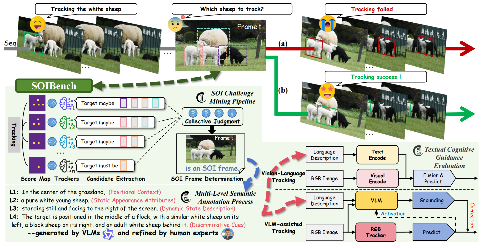

**SOI is the Root of All Evil: Quantifying and Breaking Similar Object Interference in Single Object Tracking** 
[Y. Wang](https://scholar.google.com.hk/citations?hl=zh-CN&user=nMe_kLAAAAAJ)\*, ***Shiyu Hu***\*, S. Jia, P. Xu, H. Ma, Y. Ma, J. Zhang, [X. Lu](https://automation.seu.edu.cn/lxb/list.htm), [X. Zhao](https://www.xinzhaoai.com/) (*Equal Contributions)   
📌 Visual Object Tracking 📌 Similar Object Interference 📌 Multimodal Learning 
[📃 Paper](https://www.arxiv.org/abs/2508.09524) 
[📑 PDF](https://www.arxiv.org/pdf/2508.09524) 

Preprint
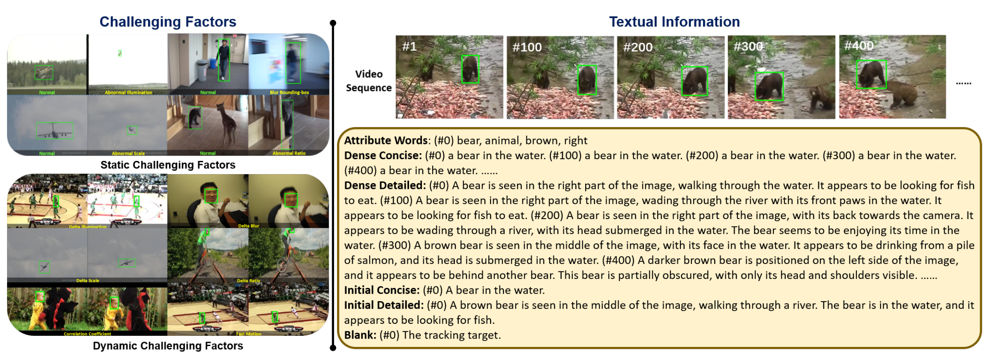

**How Texts Help? A Fine-grained Evaluation to Reveal the Role of Language in Vision-Language Tracking** 
[X. Li](https://github.com/Xuchen-Li)\*, ***Shiyu Hu***\*, [X. Feng](https://scholar.google.com.hk/citations?user=NqXtIPIAAAAJ), [D. Zhang](https://scholar.google.com.hk/citations?user=ApH4wOcAAAAJ), [M. Wu](https://scholar.google.com.hk/citations?user=fGc7NVAAAAAJ), J. Zhang, [K. Huang](https://people.ucas.ac.cn/~huangkaiqi) (*Equal Contributions)  
📌 Visual Language Tracking 📌 Multimodal Learning 📌 Evaluation Technique 
[📃 Paper](https://arxiv.org/abs/2411.15600) 
[📑 PDF](https://arxiv.org/pdf/2411.15600) 

Preprint

**DTVLT: A Multi-modal Diverse Text Benchmark for Visual Language Tracking Based on LLM** 
[X. Li](https://github.com/Xuchen-Li), ***Shiyu Hu***, [X. Feng](https://scholar.google.com.hk/citations?user=NqXtIPIAAAAJ), [D. Zhang](https://scholar.google.com.hk/citations?user=ApH4wOcAAAAJ), [M. Wu](https://scholar.google.com.hk/citations?user=fGc7NVAAAAAJ), J. Zhang, [K. Huang](https://people.ucas.ac.cn/~huangkaiqi) 
📌 Visual Language Tracking 📌 Large Language Model 📌 Evaluation Technique 
[📃 Paper](https://arxiv.org/abs/2410.02492) 
[📑 PDF](https://arxiv.org/pdf/2410.02492) 
[🌐 Project](http://videocube.aitestunion.com/) 

Preprint

**Visual Language Tracking with Multi-modal Interaction: A Robust Benchmark** 
[X. Li](https://github.com/Xuchen-Li),  ***Shiyu Hu***, [X. Feng](https://scholar.google.com.hk/citations?user=NqXtIPIAAAAJ), [D. Zhang](https://scholar.google.com.hk/citations?user=ApH4wOcAAAAJ), [M. Wu](https://scholar.google.com.hk/citations?user=fGc7NVAAAAAJ), J. Zhang, [K. Huang](https://people.ucas.ac.cn/~huangkaiqi)  
📌 Visual Language Tracking 📌 Multi-modal Interaction 📌 Evaluation Technology 
[📃 Paper](https://arxiv.org/abs/2409.08887) 
[📑 PDF](https://arxiv.org/pdf/2409.08887) 
[🌐 Project](http://videocube.aitestunion.com/) 

Preprint
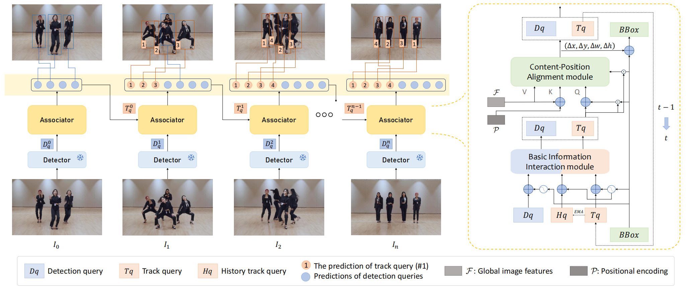

**Tracking by Detection and Query: An Efficient End-to-End Framework for Multi-Object Tracking** 
S. Jia, ***Shiyu Hu***, Y. Cao, F. Yang, X. Lu, [X. Lu](https://automation.seu.edu.cn/lxb/list.htm)   
📌 Multi-object Tracking 📌 Tracking by Detection 📌 Tracking by Query 
[📃 Paper](https://arxiv.org/abs/2411.06197) 
[📑 PDF](https://arxiv.org/pdf/2411.06197) 

Preprint
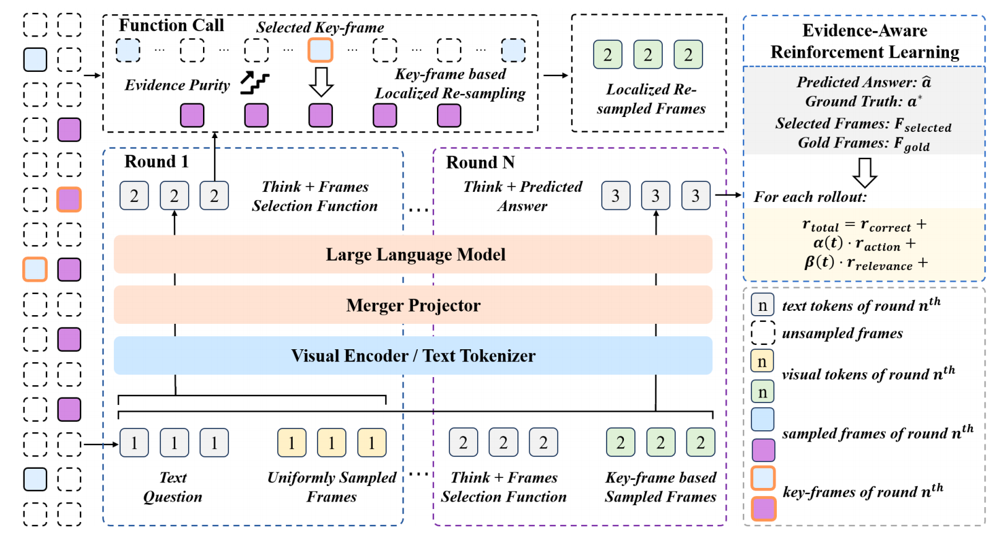

**Select Less, Reason More: Prioritizing Evidence Purity for Video Reasoning** 
[X. Li\*](https://github.com/Xuchen-Li), [X. Li\*](https://github.com/XuzhaoLi), ***Shiyu Hu***, [K. Huang](https://people.ucas.ac.cn/~huangkaiqi) 
📌 Video Large Language Models 📌 Video Reasoning 📌 Video Understanding  
[📃 Paper](https://arxiv.org/abs/2510.15440)
[📑 PDF](https://arxiv.org/pdf/2510.15440)

Preprint
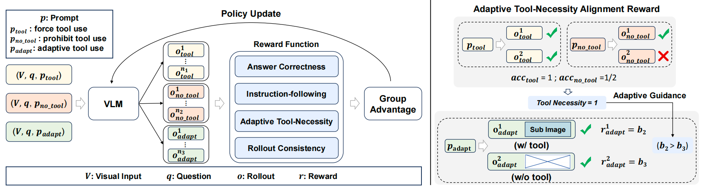

**Look Less, Reason More: Rollout-Guided Adaptive Pixel-Space Reasoning** 
[X. Li\*](https://github.com/Xuchen-Li), [X. Li\*](https://github.com/XuzhaoLi), [J. Gao](https://scholar.google.com/citations?user=0LzbaZcAAAAJ&hl=en), [R. Pi](https://scholar.google.com/citations?user=XUq0HwcAAAAJ), ***Shiyu Hu***, [W. Zhang](https://zwt233.github.io/) 
📌 Thinking-with-Image 📌 Vision-Language Models 📌 Pixel Reasoning 
[📃 Paper](https://arxiv.org/abs/2510.01681) 
[📑 PDF](https://arxiv.org/pdf/2510.01681) 

Preprint
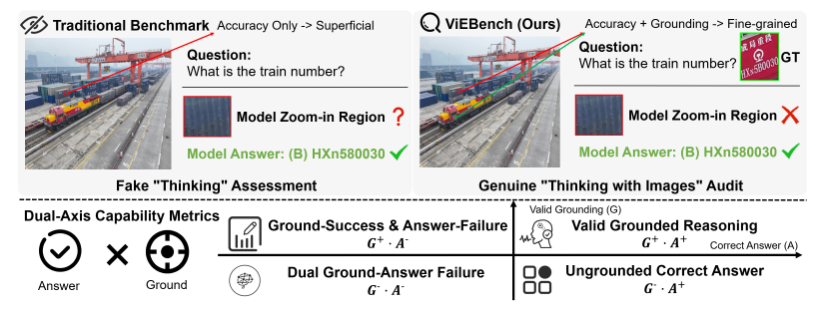

**Beyond Accuracy: Evaluating Grounded Visual Evidence in Thinking with Images** 
[X. Li\*](https://github.com/Xuchen-Li), [X. Li\*](https://github.com/XuzhaoLi), [R. Pi](https://scholar.google.com/citations?user=XUq0HwcAAAAJ), ***Shiyu Hu***, [J. Zhao](https://scholar.google.com/citations?user=n6zuurcAAAAJ),[J. Gao](https://scholar.google.com/citations?user=0LzbaZcAAAAJ&hl=en) 
📌 Thinking-with-Image 📌 Vision-Language Models 📌 Agentic Models 
[📃 Paper](https://arxiv.org/abs/2601.11633) 
[📑 PDF](https://arxiv.org/abs/2601.11633) 

Preprint

**Nearing or Surpassing: Overall Evaluation of Human-Machine Dynamic Vision Ability** 
***Shiyu Hu***, [X. Zhao](https://www.xinzhaoai.com/), [Y. Wang](https://scholar.google.com.hk/citations?hl=zh-CN&user=nMe_kLAAAAAJ), [Y. Shan](https://scholar.google.com/citations?user=_nc83HsAAAAJ), [K. Huang](https://people.ucas.ac.cn/~huangkaiqi)  
📌 Visual Object Tracking 📌 Intelligent Evaluation Technique 📌 AI4Science 
[📑 PDF](https://huuuuusy.github.io/files/VTT-ICLR.pdf)

