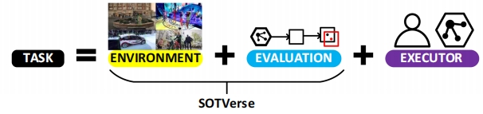

# 📝 Publications

## Acceptance

TPAMI 2023

**Global Instance Tracking: Locating Target More Like Humans** 
***Shiyu Hu***, [X. Zhao](https://www.xinzhaoai.com/), [L. Huang](https://github.com/huanglianghua), [K. Huang](https://people.ucas.ac.cn/~huangkaiqi) 
*[IEEE Transactions on Pattern Analysis and Machine Intelligence](https://ieeexplore.ieee.org/xpl/RecentIssue.jsp?punumber=34) (CCF-A Journal, IF=23.6)* 
📌 Visual Object Tracking 📌 Large-scale Benchmark Construction 📌 Intelligent Evaluation Technology  
[📃 Paper](https://ieeexplore.ieee.org/document/9720246/)
[🗒 bibTex](https://huuuuusy.github.io/files/GIT.bib)
[📑 PDF](https://huuuuusy.github.io/files/GIT.pdf)
[🌐 Platform](http://videocube.aitestunion.com/)
[🔧 Toolkit](https://github.com/huuuuusy/videocube-toolkit) 
[💾 Dataset](http://videocube.aitestunion.com/downloads)

IJCV 2023

**SOTVerse: A User-defined Task Space of Single Object Tracking** 
***Shiyu Hu***, [X. Zhao](https://www.xinzhaoai.com/), [K. Huang](https://people.ucas.ac.cn/~huangkaiqi) 
*[International Journal of Computer Vision](https://www.springer.com/journal/11263) (CCF-A Journal, IF=19.5)* 
📌 Visual Object Tracking 📌 Dynamic Open Environment Construction 📌 Visual Evaluation Technique 
[📃 Paper](https://link.springer.com/article/10.1007/s11263-023-01908-5)
[🗒 bibTex](https://huuuuusy.github.io/files/SOTVerse.bib)
[📑 PDF](https://huuuuusy.github.io/files/SOTVerse.pdf)
[🌐 Platform](http://metaverse.aitestunion.com/) 

IJCV 2023

**BioDrone: A Bionic Drone-based Single Object Tracking Benchmark for Robust Vision** 
[X. Zhao](https://www.xinzhaoai.com/), ***Shiyu Hu✉️***, [Y. Wang](https://github.com/updateforever), J. Zhang, Y. Hu, R. Liu, [H. Lin](https://www3.cs.stonybrook.edu/~hling/), [Y. Li](https://www.biostat.wisc.edu/~yli/), R. Li, K. Liu, [J. Li](http://yjsb.sinano.ac.cn/Doctor/info.aspx?itemid=920)  
*[International Journal of Computer Vision](https://www.springer.com/journal/11263) (CCF-A Journal, IF=19.5)* 
📌 Visual Object Tracking 📌 Drone-based Tracking 📌 Visual Evaluation Technique 
[📃 Paper](https://link.springer.com/article/10.1007/s11263-023-01937-0)
[🌐 Platform](http://biodrone.aitestunion.com/) 
[🗒 bibTex](https://huuuuusy.github.io/files/BioDrone.bib) 
[📑 PDF](https://huuuuusy.github.io/files/BioDrone.pdf)
[🔧 Toolkit](https://github.com/huuuuusy/biodrone-toolkit-official) 
[💾 Dataset](http://biodrone.aitestunion.com/downloads) 

NeurIPS 2023

**A Multi-modal Global Instance Tracking Benchmark (MGIT): Better Locating Target in Complex Spatio-temporal and causal Relationship** 
***Shiyu Hu***, D. Zhang, [M. Wu](https://github.com/wmeiqi), [X. Feng](https://github.com/XiaokunFeng), [X. Li](https://xuchen-li.github.io/), [X. Zhao](https://www.xinzhaoai.com/), [K. Huang](https://people.ucas.ac.cn/~huangkaiqi) 
*[the 37th Conference on Neural Information Processing Systems](https://neurips.cc/Conferences/2023) (CCF-A Conference, Poster)* 
📌 Visual Language Tracking 📌 Long Video Understanding and Reasoning 📌 Hierarchical Semantic Information Annotation 
[📃 PDF](https://huuuuusy.github.io/files/MGIT.pdf)
[🪧 Poster](https://huuuuusy.github.io/files/MGIT-poster.pdf)
[📹 Slides](https://huuuuusy.github.io/files/MGIT-Slides.pdf)
[🌐 Platform](http://videocube.aitestunion.com/)
[💾 Dataset]([[Toolkit](https://github.com/huuuuusy/videocube-toolkit)]) 

中国图象图形学报 2023

**Visual Intelligence Evaluation Techniques for Single Object Tracking: A Survey (单目标跟踪中的视觉智能评估技术综述)** 
***Shiyu Hu***, [X. Zhao](https://www.xinzhaoai.com/), [K. Huang](https://people.ucas.ac.cn/~huangkaiqi) 
*[Journal of Images and Graphics](http://www.cjig.cn/jig/ch/index.aspx) (《中国图象图形学报》, CCF-B Chinese Journal)* 
📌 Visual Object Tracking 📌 Intelligent Evaluation Technique 📌 AI4Science 
[📃 Paper](http://www.cjig.cn/jig/ch/reader/view_abstract.aspx?flag=2&file_no=202307100000002&journal_id=jig) 
[📑 PDF](https://huuuuusy.github.io/files/JIG-survey.pdf) 

ICASSP 2024

**Robust Single-particle Cryo-EM Image Denoising and Restoration** 
J. Zhang, T. Zhao, ***Shiyu Hu***, [X. Zhao](https://www.xinzhaoai.com/) 
*[the 49th IEEE International Conference on Acoustics, Speech, and Signal Processing](https://2024.ieeeicassp.org/) (CCF-B Conference, Poster)* 
📌 Medical Image Processing 📌 AI4Science 📌 Diffusion Model 
[📑 PDF](https://huuuuusy.github.io/files/ICASSP24.pdf)

PRCV 2023

**A Hierarchical Theme Recognition Model for Sandplay Therapy** 
[X. Feng](https://github.com/XiaokunFeng), ***Shiyu Hu***, [X. Chen](http://www.crise.ia.ac.cn/teachers_view.aspx?TypeId=141&Id=467&Fid=t26:141:26), [K. Huang](https://people.ucas.ac.cn/~huangkaiqi) 
*[the 6th Chinese Conference on Pattern Recognition and Computer Vision](https://www.prcv2023.cn/2023prcv) (CCF-C Conference, Poster)* 
📌 Psychological Assessment System 📌 Gamified Assessment 📌 AI4Science 
[📃 Paper](https://link.springer.com/chapter/10.1007/978-981-99-8462-6_20) 
[🗒 bibTex](https://huuuuusy.github.io/files/PRCV23.bib) 
[📑 PDF](https://huuuuusy.github.io/files/PRCV23.pdf)
[🔖 Supplementary](https://huuuuusy.github.io/files/PRCV23-Supp.pdf)
[🪧 Poster](https://huuuuusy.github.io/files/PRCV23-poster.pdf)

CSAI 2023

**Rethinking Similar Object Interference in Single Object Tracking** 
[Y. Wang](https://github.com/updateforever), ***Shiyu Hu***, [X. Zhao](https://www.xinzhaoai.com/) 
*[the 7th International Conference on Computer Science and Artificial Intelligence](http://www.csai.org/) (EI Conference, **Oral**)* 
📌 Visual Object Tracking 📌 Similar Object Interference 📌 Data Mining 

Neurocomputing 2022

**Revisiting Instance Search: A New Benchmark Using Cycle Self-training** 
[Y. Zhang](https://wesleyzhang1991.github.io/), [C. Liu](https://scholar.google.com/citations?user=atOfOgMAAAAJ&hl=zh-CN&oi=sra), [W. Chen](https://scholar.google.com/citations?user=KWVlYaMAAAAJ&hl=zh-CN&oi=sra), [X. Xu](https://scholar.google.com/citations?user=nJc6BvgAAAAJ&hl=zh-CN&oi=sra), [F. Wang](https://scholar.google.com/citations?user=WCRGTHsAAAAJ), [H. Li](https://scholar.google.com/citations?user=pHN-QIwAAAAJ&hl=zh-CN&oi=sra), ***Shiyu Hu***, [X. Zhao](https://www.xinzhaoai.com/) 
*[Neurocomputing](https://www.sciencedirect.com/journal/neurocomputing)  (CCF-C Journal, IF=6)* 
📌 Video Instance Search 📌 Benchmark Construction  📌 Data Mining 
[📃 Paper](https://www.sciencedirect.com/science/article/abs/pii/S0925231222007445) 
[🗒 bibTex](https://huuuuusy.github.io/files/Neu22.bib) 
[📑 PDF](https://huuuuusy.github.io/files/Neu22.pdf) 
[🌐 Project](https://github.com/Instance-Search/) 

图学学报 2021

**Visual Turing: The Next Development of Computer Vision in The View of Human-computer Gaming (视觉图灵：从人机对抗看计算机视觉下一步发展)** 
[K. Huang](https://people.ucas.ac.cn/~huangkaiqi), [X. Zhao](https://www.xinzhaoai.com/), [Q. Li](https://scholar.google.com/citations?user=7xmxBagAAAAJ), ***Shiyu Hu*** 
*[Journal of Graphics](http://www.txxb.com.cn/CN/2095-302X/home.shtml) (《图学学报》, CCF-C Chinese Journal)* 
📌 Visual Object Tracking 📌 Intelligent Evaluation Technique  📌 AI4Science 
[📃 Paper](http://www.txxb.com.cn/CN/10.11996/JG.j.2095-302X.2021030339) 
[🗒 bibTex](https://huuuuusy.github.io/files/VTT.bib) 
[📑 PDF](https://huuuuusy.github.io/files/VTT.pdf)

## Under Review

TCSVT 2024

**Target or Distractor? Rethinking Similar Object Interference in Single Object Tracking** 
[Y. Wang](https://github.com/updateforever), ***Shiyu Hu***, D. Zhang, [M. Wu](https://github.com/wmeiqi), [T. Yao](http://tingyao.deepfun.club/), [Y. Wang](https://scholar.google.com/citations?user=3nMDEBYAAAAJ), [L. Chen](https://sie.bit.edu.cn/szdw/jsml/ldjsyjsj/zgzcl/06c26b3ebaae4db981aaa388c660c8b5.htm), [X. Zhao](https://www.xinzhaoai.com/)  
*[IEEE Transactions on Circuits and Systems for Video Technology](https://ieeexplore.ieee.org/xpl/RecentIssue.jsp?punumber=76) (CCF-B Journal, IF=8.4, Under Review)* 
📌 Visual Object Tracking 📌 Similar Object Interference 📌 Data Mining 

TCSVT 2024

**Finger in Camera Speaks Everything: Unconstrained Air-Writing for Real-World** 
[M. Wu](https://github.com/wmeiqi), [K. Huang](https://people.ucas.ac.cn/~huangkaiqi), [Y. Cai](https://teacher.bupt.edu.cn/caiyuanqiang/zh_CN/index.htm), ***Shiyu Hu***, [Y. Zhao](https://callsys.github.io/zhaoyuzhong.github.io-main/), [W. Wang](https://people.ucas.ac.cn/~wqwang?language=en)  
*[IEEE Transactions on Circuits and Systems for Video Technology](https://ieeexplore.ieee.org/xpl/RecentIssue.jsp?punumber=76) (CCF-B Journal, IF=8.4, Under Review)* 
📌 Air-writing Technique 📌 Benchmark Construction 📌 Human-machine Interaction 

IJCAI 2024

**Remembering Target More Like Humans: A Robust Visual-Language Tracker with Adaptive Prompts** 
[X. Feng](https://github.com/XiaokunFeng), [X. Li](https://xuchen-li.github.io/), ***Shiyu Hu***, D. Zhang, [M. Wu](https://github.com/wmeiqi), [X. Chen](http://www.crise.ia.ac.cn/teachers_view.aspx?TypeId=141&Id=467&Fid=t26:141:26), [K. Huang](https://people.ucas.ac.cn/~huangkaiqi)   
*[the 33rd International Joint Conference on Artificial Intelligence](https://www.ijcai.org/) (CCF-A Conference, Under Review)* 
📌 Visual Language Tracking 📌 Human-like Memory Modeling 📌 Adaptive Prompts 

心理学报 2024

**Intelligent Psychological Assessment with Sandplay based on Evidence-Centered Design Theory (基于证据中心设计理论的智能心理沙盘测评系统)** 
Y. Ren, [X. Feng](https://github.com/XiaokunFeng), ***Shiyu Hu***, Y. Kang, C. Yan, Y. Zeng, [L. Wang](https://people.ucas.ac.cn/~wanglg), [K. Huang](https://people.ucas.ac.cn/~huangkaiqi)   
*[Acta Psychologica Sinica](https://journal.psych.ac.cn/xlxb/CN/0439-755X/home.shtml) (《心理学报》, CSSCI Journal, Top-1 Psychological Journal in China, Under Review)* 
📌 Psychological Assessment System 📌 Gamified Assessment 📌 AI4Science 

# ⚙️ Projects

> The list here mainly includes engineering projects and ongoing academic projects, while more academic projects have already been published in the form of research papers. Please refer to the [📝 Publications](https://huuuuusy.github.io/#-publications) for more information.

2018.03-2018.11

**Darknet-Cross: Light-weight Deep Learning Framework for Heterogeneous Computing** 
📌 High-performance Computing 📌 Heterogeneous Computing 📌 Deep learning Framework 
- [Darknet-Cross](https://github.com/huuuuusy/Darknet-Cross) is a lightweight deep learning framework, mainly based on the open-source deep learning algorithm library Darknet and yolov2_light, and it has been successfully ported to mobile devices through cross-compilation. This framework enables efficient algorithm inference using mobile GPUs.
- Darknet-Cross supports algorithm acceleration processing on various platforms (e.g., Android and Ubuntu) and various GPUs (e.g., Nvidia GTX1070 and Adreno 630).
- The work is a part of my master's thesis at the University of Hong Kong (thesis defense grade: A+).

2019.05 - 2019.10

**A Skin Color Detection System without Color Atla** 
📌 Color Constancy 📌 Skin Color Detection 📌 Illumination Estimation 
- Under 18 different environmental lighting conditions and with 4 combinations of smartphone parameters, skin color data was collected from 110 participants. The skin color dataset consists of 7,920 images, with the testing results from CK Company's MPA9 skin color detector serving as the ground truth for user skin colors.
- Using an elliptical skin model, the essential skin regions are extracted from the images. The open-source color constancy model, FC4, is employed to recover the environmental lighting conditions. Subsequently, the skin color detection results for users are calculated using SVR regression.
- The related work has been successfully deployed in Huawei's official mobile application 'Mirror' for its AI skin testing function.

2020.11 - 2021.03

**A Project for Cell Tracking Based on Deep Learning Method** 
📌 Medical Image Processing 📌 AI4Science 📌 Cell Segmentation and Tracking 
- This method follows the tracking by detection paradigm and combines per-frame CNN prediction for cell segmentation with a Siamese network for cell tracking. 
- This project was submitted to the cell tracking challenge in Mar. 2021, and maintains the second place in the Fluo-C2FL-MSC+ dataset and the third place in the Fluo-C2FL-Huh7 dataset (statistics by Oct. 2023).

2022.04 - Now

**Intelligent Evaluation Techniques for Visual Object Tracking Based on Visual Turing Test** 
📌 Visual Object Tracking 📌 Intelligent Evaluation Technique 📌 AI4Science 
- This work proposes the visual Turing test evaluation paradigm by incorporating the concept of the Turing test, enabling a comprehensive assessment of the visual intelligence of algorithms in comparison to human visual capabilities.
- A controlled experimental environment has been developed to facilitate a fair comparison of dynamic visual abilities between humans and machines. This environment incorporates the perceptual and cognitive capabilities that task objects necessitate during the execution of dynamic visual tasks.
- A suitable task object is selected to conduct tests on human-machine dynamic visual abilities, involving 20 representative algorithms and 15 human subjects.
- A universally applicable multi-scale dynamic visual task evaluation framework has been designed. This framework employs center point distance to assess and analyze tasks at three distinct scales, namely frame-level, sequence-level, and group-level.
- Two Chinese review papers were published in 2021 and 2023. The experimental content and main conclusions are being finalized, preparing for submission to the Cell Patterns journal.

